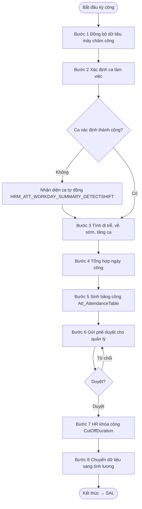

# Flow – Tính công ATT (8 bước)

Luồng nghiệp vụ tính công hằng tháng trong HRM Pro 8 — từ dữ liệu thô máy chấm công đến bảng công sẵn sàng tính lương.

## Sơ đồ luồng

## Chi tiết từng bước

### Bước 1 — Đồng bộ dữ liệu máy chấm công
- Nguồn: máy chấm công (SQL, kết nối qua Tab 2 `Sys_ConfigDB`)
- Dữ liệu raw: giờ in/out → lưu vào TamScanLog
- Config liên quan: `HRM_ATT_DATABASETYPE`, `HRM_ATT_TAM_LOADDATA`

### Bước 2 — Xác định ca làm việc
- So sánh giờ chấm công với Cat_Shift
- Tự nhận diện ca nếu `HRM_ATT_WORKDAY_SUMMARY_DETECTSHIFT=True`
- Xử lý đa ca: ShiftID + Shift2ID trong Att_AttendanceTableItem
- Xử lý MissTAM: `HRM_ATT_MISSTAM_LEAVETYPE=E_OFF_LESS`

### Bước 3 — Tính đi trễ, về sớm, tăng ca
- **Đi trễ**: FirstInTime − Ca.StartTime → LateInMinutes
- **Về sớm**: Ca.EndTime − LastOutTime → EarlyOutMinutes
- **OT**: giờ làm vượt ca → phân loại theo loại ngày (thường/nghỉ/lễ/đêm)
- Làm tròn OT: `HRM_ATT_OT_COMPUTE_ROUNDHOUR=0.5`, tối thiểu `HRM_ATT_OT_COMPUTE_MINHOUROT=0.5`

### Bước 4 — Tổng hợp ngày công
- Áp dụng công thức: `Công thực nhận = (Công đi làm + Nghỉ hưởng lương) − (Công trừ + Nghỉ không lương + Vi phạm)`
- Tổng hợp phép năm: `HRM_ATT_WORKDAY_SUMMARY_ISSUMMARIZEANDANNUALLEAVETOCOMPUTEWORKDAY=True`
- Công thức tổng công: `[PaidLeaveDay]+[PaidWorkDayCount]`

### Bước 5 — Sinh bảng công
- Ghi vào `Att_AttendanceTable` (tổng hợp tháng)
- Ghi vào `Att_AttendanceTableItem` (chi tiết ngày)
- Cập nhật `Att_AnnualDetail` (phép tháng)
- Config: `HRM_ATT_WORKDAY_SUMMARY_ISSAVEWORKDAYNOTROSTER=True`

### Bước 6 — Gửi phê duyệt
- Quản lý trực tiếp duyệt bảng công
- Trạng thái: E_SUBMIT → E_APPROVED
- Có thể duyệt nhiều bản ghi qua email

### Bước 7 — HR khóa công
- HR/C&B xác nhận và khóa kỳ công `Att_CutOffDuration`
- `HRM_ATT_CONFIG_ISALLOWAPPROVEDATALOCKEDANDTRANFERCUTOFDUATIONLEAVEDAY=True`
- Sau khóa: không sửa được trừ khi có quyền đặc biệt

### Bước 8 — Chuyển sang tính lương
- Dữ liệu từ Att_AttendanceTable → module SAL
- Xem [[wiki/flows/Flow-TinhLuong-Monthly]] — kỳ lương tháng full pipeline

## Actors

| Actor | Vai trò |
|-------|---------|
| Nhân viên | Chấm công, đăng ký nghỉ/OT |
| Quản lý trực tiếp | Duyệt bảng công, duyệt OT |
| HR / C&B | Điều chỉnh công, khóa kỳ |
| Bộ phận lương | Nhận dữ liệu từ ATT |

## Nguồn dữ liệu đầu vào

| Nguồn | Bảng |
|-------|------|
| Máy chấm công | TamScanLog |
| Đăng ký nghỉ phép | Att_LeaveDay |
| Đăng ký tăng ca | Att_Overtime |
| Ca làm việc / lịch | Cat_Shift, Att_Roster |
| Điều chỉnh công | Att_WorkdayAdjust |
| GPS / Mobile | Att_TamScanGPS |

## Kết quả đầu ra

- **Att_AttendanceTable** — bảng công tháng (PaidWorkDayCount, OT, nghỉ, trễ)
- **Att_AttendanceTableItem** — chi tiết từng ngày
- **Att_AnnualDetail** — phép năm cập nhật
- Báo cáo công, thống kê vi phạm
