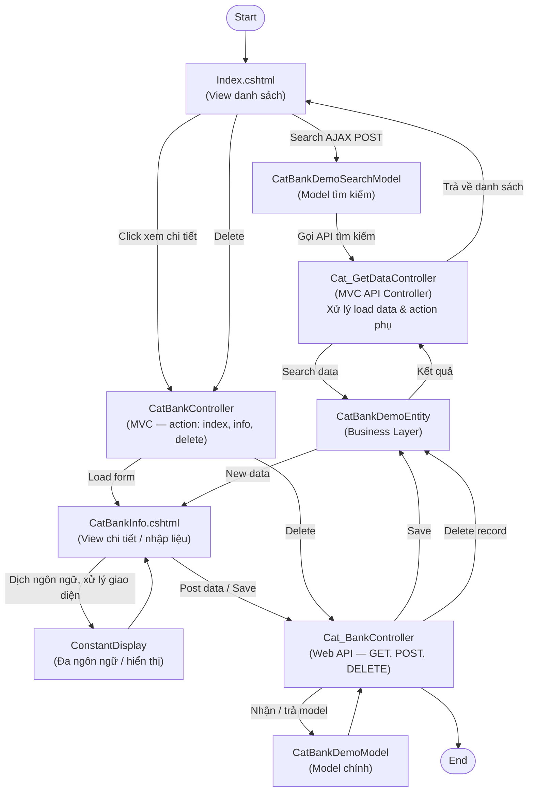

# Flow — CatBank (Danh mục Ngân hàng)

> **Loại**: System Flow
> **Trigger**: User thao tác trên màn hình Danh mục Ngân hàng (Search / View Info / Delete / Save)
> **Phân hệ liên quan**: SYS — Danh mục hệ thống
> **Màn hình mẫu**: Dùng để đào tạo developer mới HRM

---

## Tổng quan

Màn hình CatBank (Danh mục Ngân hàng) là màn hình demo chuẩn dùng trong đào tạo developer mới HRM. Luồng thể hiện đầy đủ kiến trúc 4 tầng của hệ thống: View → MVC Controller → HR Service (MVC API + Web API) → Business Entity.

---

## Sơ đồ

---

## Chi tiết từng bước

### Bước 1 — User vào màn hình Index

**Actor**: User
- Render `Index.cshtml`, hiển thị danh sách ngân hàng
- Kích hoạt search mặc định hoặc theo filter người dùng nhập

### Bước 2 — Tìm kiếm (Search)

**Trigger**: User nhấn nút tìm kiếm
- `Index.cshtml` POST data qua **AJAX** tới `CatBankDemoSearchModel`
- `Cat_GetDataController` (MVC API) nhận request → gọi `CatBankDemoEntity` query DB
- Kết quả trả về render lại grid (không reload trang)

### Bước 3 — Xem chi tiết / Nhập liệu

**Trigger**: User click vào một record
- `CatBankController` (MVC) xử lý action `info` → render `CatBankInfo.cshtml`
- View gọi `ConstantDisplay` để dịch ngôn ngữ theo setting hệ thống

### Bước 4 — Lưu dữ liệu (POST)

**Trigger**: User submit form trên `CatBankInfo.cshtml`
- Form POST data lên `Cat_BankController` (Web API)
- Web API binding `CatBankDemoModel` → gọi `CatBankDemoEntity.Save()`
- Entity trả `New data` về View để refresh

### Bước 5 — Xóa record (DELETE)

**Trigger**: User nhấn Delete — từ Index **hoặc** từ Info
- `CatBankController` (MVC) nhận action `delete`
- Chuyển tiếp → `Cat_BankController` (Web API) → `CatBankDemoEntity.Delete()`
- Index refresh danh sách sau khi xóa thành công

---

## Điểm rủi ro

| Rủi ro | Tác động | Phòng tránh |
|--------|---------|------------|
| Delete không kiểm tra FK | Lỗi constraint DB | Validate FK ở tầng Business trước khi xóa |
| AJAX search không handle lỗi timeout | Màn hình treo, UX xấu | Thêm error handler + loading state |
| ConstantDisplay thiếu key ngôn ngữ | Hiển thị raw key thay vì text | Kiểm tra resource file khi thêm field mới |

---

## Liên kết

- [[wiki/sources/b6n3w-sys-flow-catbank-08]] — Nguồn raw của flow này
- [[wiki/sources/p4m7x-catbank-search-structure]] — 9 component chi tiết CatBank
- [[wiki/architecture/k9r2b-catbank-mvc-architecture]] — Kiến trúc 4 tầng tương ứng
- [[wiki/flows/Flow-DaoTao-DevMoi-HRM]] — Lộ trình đào tạo dev, CatBank là ví dụ mẫu
