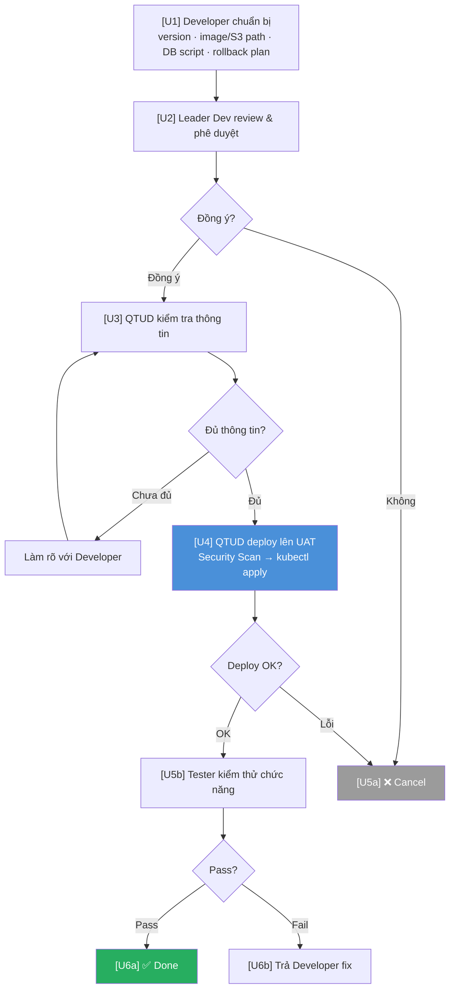
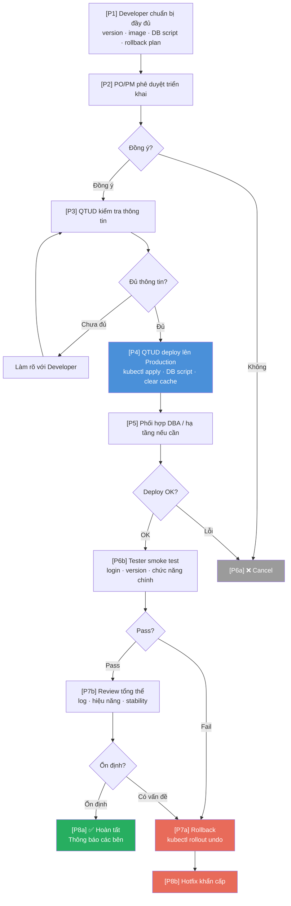

# Flow — Deploy HRM lên Kubernetes

> **Loại**: Integration Flow — CI/CD
> **Trigger**: Có bản build mới cần cập nhật lên UAT hoặc Production
> **Phân hệ liên quan**: Tất cả service HRM (Main, Portal, Hr.Service, HrmSystem.Service, Identity, Api, Chat)

---

## Tổng quan

Quy trình triển khai HRM lên Kubernetes được chia thành 2 giai đoạn rõ ràng theo ranh giới trách nhiệm:

| Giai đoạn | Đơn vị thực hiện | Nội dung |
|-----------|-----------------|---------|
| **CI** — Build & Push image | **VNR** | Build Docker image, đóng gói, push lên S3 hoặc Registry |
| **CD** — Deploy lên K8s | **Khách hàng** | Nhận image, security scan, deploy lên cluster |

> ⚠️ VNR **không có quyền** trực tiếp thao tác trên K8s cluster của khách hàng.

---

## Luồng 1 — Cập nhật lên UAT

### Các bên tham gia

| Vai trò | Đơn vị |
|---------|--------|
| Developer | VNR |
| Leader Dev | VNR |
| QTUD (Quản trị ứng dụng) | Khách hàng |
| Tester | Khách hàng |

### Sơ đồ

### Chi tiết từng bước

| Mã | Người thực hiện | Nội dung |
|----|----------------|---------|
| U1 | Developer (VNR) | Chuẩn bị: version build, danh sách service, DB migration script, phạm vi ảnh hưởng, rollback plan |
| U2 | Leader Dev (VNR) | Review code changes, xác nhận phạm vi không vượt scope. OK → tiếp tục, NOK → Cancel |
| U3 | QTUD (Khách hàng) | Kiểm tra đầy đủ thông tin deploy. Nếu thiếu → yêu cầu Developer làm rõ |
| U4 | QTUD (Khách hàng) | Security Scan image → deploy lên UAT cluster (`kubectl apply`) → xác nhận service running |
| U5a | — | Deploy lỗi → Cancel, báo VNR |
| U5b | Tester (Khách hàng) | Functional test + Regression test |
| U6a | — | Pass → ✅ Done |
| U6b | — | Fail → trả Developer fix, lặp lại từ U1 |

**Checklist Developer gửi QTUD (UAT)**:
- [ ] Version build (vd: `v80.1.0`)
- [ ] Danh sách service cần cập nhật
- [ ] DB migration script (nếu có)
- [ ] Phạm vi ảnh hưởng
- [ ] Rollback plan

---

## Luồng 2 — Cập nhật lên Production

### Các bên tham gia

| Vai trò | Đơn vị |
|---------|--------|
| Developer | VNR |
| PO / PM | VNR hoặc Khách hàng |
| QTUD | Khách hàng |
| Tester | Khách hàng |

### Sơ đồ

### Chi tiết từng bước

| Mã | Người thực hiện | Nội dung |
|----|----------------|---------|
| P1 | Developer (VNR) | Chuẩn bị đầy đủ: version, danh sách service, DB migration script, hướng dẫn deploy, rollback plan |
| P2 | PO/PM | Xác nhận đúng kế hoạch release, không ngoài phạm vi. OK → tiếp, NOK → Cancel |
| P3 | QTUD (Khách hàng) | Kiểm tra checklist deploy, yêu cầu làm rõ nếu thiếu thông tin |
| P4 | QTUD (Khách hàng) | Deploy: `kubectl apply`, chạy DB script, restart service, clear Redis cache, update ConfigMap/Secret |
| P5 | QTUD + DBA | Phối hợp DBA / hạ tầng nếu có thay đổi DB hoặc infra |
| P6a | — | Deploy lỗi → Cancel |
| P6b | Tester (Khách hàng) | Smoke test: đăng nhập Main site, đăng nhập Portal, version đúng, chức năng chính |
| P7a | — | Fail → **Rollback** (`kubectl rollout undo`) |
| P7b | Leader Dev + PO | Pass → Review log, hiệu năng, xác nhận với nghiệp vụ |
| P8a | — | Ổn định → ✅ Hoàn tất, thông báo team + khách hàng |
| P8b | — | Có vấn đề → Rollback + Hotfix khẩn cấp |

**Smoke test checklist (Production)**:
- [ ] Đăng nhập Main site thành công
- [ ] Đăng nhập Employee Portal thành công
- [ ] Version hiển thị đúng
- [ ] Kiểm tra chức năng chính của bản release

---

## Config & Secret trên K8s

| Thành phần | Giải pháp | Trách nhiệm |
|------------|-----------|------------|
| Cấu hình ứng dụng | K8s **ConfigMap** | Khách hàng |
| Mật khẩu / credentials | K8s **Secret** | Khách hàng |
| Quản lý secret tập trung | **HashiCorp Vault** | Khách hàng |

> ⚠️ **VNR cần**: Source code đọc config từ ConfigMap/Secret — **không hardcode trong `appsettings.json`**.

---

## Điểm rủi ro

| Rủi ro | Tác động | Phòng tránh |
|--------|---------|------------|
| Image bị reject sau security scan | Delay deploy | VNR tuân thủ security baseline của khách hàng từ sớm |
| DB migration lỗi | Rollback toàn bộ | Test script trên UAT trước, chuẩn bị rollback script |
| Service CrashLoop sau deploy | Production downtime | Smoke test UAT kỹ trước khi lên PRD |
| ConfigMap/Secret chưa update | App lỗi config | Khách hàng chuẩn bị trước, VNR confirm key names |
| Rollback không thành công | Cần hotfix khẩn | Luôn có hotfix plan sẵn sàng |

---

## Liên kết

- [[wiki/sources/k8d2p-flow-capnhat-k8s-hrm]] — Tài liệu nguồn
- [[wiki/architecture/HRM-Deployment-Architecture]] — Kiến trúc deploy IIS + K8s
- [[wiki/flows/Flow-Deploy-HRM]] — Quy trình deploy HRM (bao gồm IIS warmup)
- [[wiki/concepts/HRM-Deploy-Checklist]] — Checklist deploy server mới
