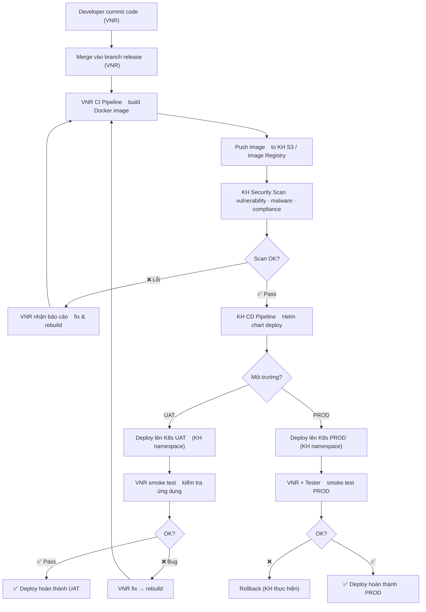

# Flow — CI/CD Deploy HRM lên K8s

> **Loại**: System Flow  
> **Trigger**: Developer push code → merge vào branch release  
> **Kết quả**: Image mới được deploy lên K8s cluster của KH

---

## Tổng quan

Quy trình CI/CD phân tách rõ ràng giữa **VNR (CI)** và **KH — Khách hàng (CD)**:
- VNR chịu trách nhiệm build image, push lên storage của KH
- KH chịu trách nhiệm scan security, deploy, vận hành cluster

**Nguyên tắc cốt lõi**: Bản build UAT = bản build PROD — promote image, không build lại.

---

## Sơ đồ

---

## Chi tiết từng bước

### Bước 1 — Developer commit & merge (VNR)
**Người thực hiện**: Developer VNR  
- Commit code, tạo Pull Request
- Leader Dev review → approve → merge vào branch release
- Tag version theo convention: `v8.x.x.x`

### Bước 2 — VNR CI build Docker image
**Người thực hiện**: VNR CI pipeline (automated)  
- Dockerfile Multi-stage build (Alpine runtime)
- Build từ source .NET 8
- Tag image: `<registry>/hrm-<service>:<version>`
- Image **không chứa** config / secret (chỉ code)

### Bước 3 — Push image lên KH S3 / Registry
**Người thực hiện**: VNR CI pipeline  
- Push lên KH image registry / S3 artifact storage
- Notify KH image đã sẵn sàng để scan

### Bước 4 — KH Security Scan
**Người thực hiện**: KH (tự động)  
- Quét vulnerability (CVE database)
- Quét malware
- Kiểm tra compliance (non-root, base image policy)
- Nếu fail: báo cáo cho VNR → VNR fix → rebuild

### Bước 5 — KH CD deploy (Helm chart)
**Người thực hiện**: KH CD pipeline  
- Helm chart đã được VNR chuẩn bị + KH approve
- Deploy vào namespace K8s tương ứng (UAT / PROD)
- Inject ConfigMap và Secret từ Vault

### Bước 6 — Smoke test
**Người thực hiện**: VNR (UAT) / VNR + Tester (PROD)  
- Kiểm tra các chức năng cơ bản
- Kiểm tra log không có lỗi khởi động
- Kiểm tra health endpoint `/health/live` và `/health/ready`

### Bước 7 — Rollback (nếu cần, chỉ PROD)
**Người thực hiện**: KH (thực hiện rollback trên cluster)  
- Helm rollback về version trước
- VNR xác nhận sau rollback

---

## Điểm rủi ro

| Rủi ro | Tác động | Phòng tránh |
|--------|---------|------------|
| Image scan fail do CVE trong base image | Chậm deploy | Dùng base image Alpine + update thường xuyên |
| Config hardcode trong image | Không promote được UAT→PROD | Tuân thủ checklist ConfigMap/Vault |
| Smoke test bỏ sót lỗi | Bug trên PROD | Có rollback plan rõ ràng |
| KH không có CI/CD template | VNR không biết format | Yêu cầu KH gửi template sớm |

---

## Liên kết

- [[wiki/sources/p9k2w-deploy-k8s-hrm-planning]] — Tài liệu kế hoạch đầy đủ
- [[wiki/flows/k8d2p-flow-deploy-k8s-hrm]] — Flow deploy K8s tổng quan (ingest trước)
- [[wiki/flows/v2k9m-flow-golive-k8s]] — Quy trình go-live PROD chi tiết
- [[wiki/architecture/p9k2w-k8s-hrm-service-architecture]] — Kiến trúc service
