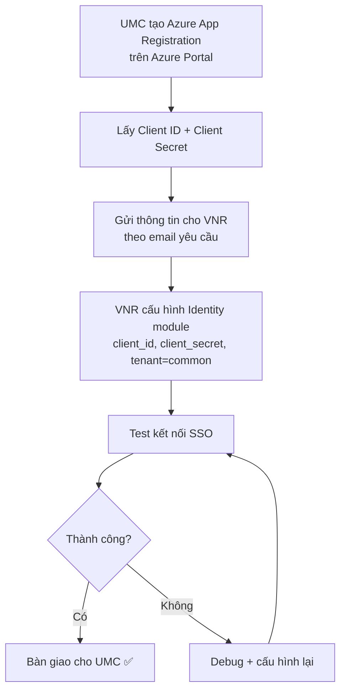
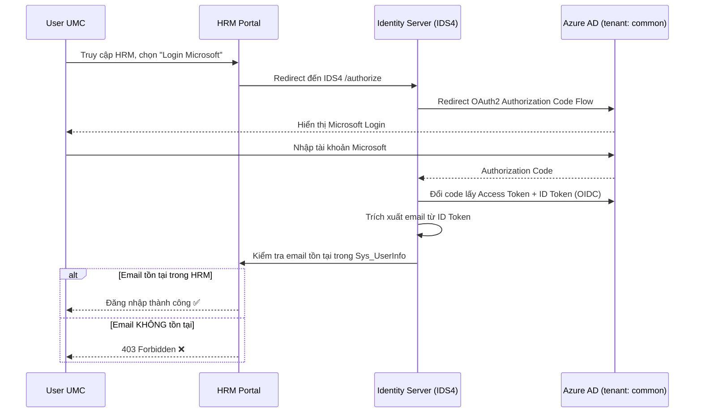

# Flow — SSO Microsoft (OAuth2/OIDC) cho UMC

> **Loại**: Integration Flow  
> **Trigger**: User truy cập HRM → chọn "Đăng nhập bằng Microsoft"  
> **Phân hệ liên quan**: Identity (IDS4), HRM Main/Portal

---

## Tổng quan

Luồng SSO Microsoft cho phép nhân viên UMC đăng nhập HRM bằng tài khoản Microsoft Azure AD. VNR dùng tenant `common` (không giới hạn tenant) nhưng có lớp guard 403 nếu email user không tồn tại trong HRM.

---

## Sơ đồ — Luồng cấu hình (một lần, do admin thực hiện)

---

## Sơ đồ — Luồng đăng nhập (mỗi lần user login)

---

## Chi tiết từng bước

### Bước 1 — UMC tạo Azure App Registration

**Người thực hiện**: LaiNguyenTuanAnh (phụ trách) + PhamNgocDao (hỗ trợ) — Phòng CNTT UMC

- Vào Azure Portal → Azure Active Directory → App registrations → New registration
- Đặt tên ứng dụng (ví dụ: `HRM-VNR-SSO`)
- Supported account types: **Accounts in any organizational directory (Any Azure AD) and personal accounts** ← dùng `common`
- Cấu hình Redirect URI: `<Redirect URI của HRM>` (VNR cung cấp)
- Tạo Client Secret (Certificates & secrets → New client secret)
- Cấp quyền API: **User.Read** (tối thiểu để đọc email/profile)
- Lấy **Application (client) ID** và **Client Secret value**
- Gửi thông tin cho VNR theo email yêu cầu

### Bước 2 — VNR cấu hình Identity module

**Người thực hiện**: VNR team

- Nhận Client ID + Client Secret từ UMC
- Cấu hình vào Identity Server (IDS4):
  - `client_id` = Application ID của Azure App Registration
  - `client_secret` = Secret value từ Azure
  - `tenant` = `common`
- Cấu hình Redirect URI khớp với Azure App Registration

### Bước 3 — User đăng nhập

- User truy cập HRM → chọn Login Microsoft
- Được redirect qua Azure AD login page
- Sau khi Azure xác thực → HRM nhận email từ ID Token
- HRM kiểm tra email trong `Sys_UserInfo`
  - ✅ Tồn tại → vào HRM
  - ❌ Không tồn tại → 403 Forbidden

---

## Điểm rủi ro

| Rủi ro | Tác động | Phòng tránh |
|--------|---------|------------|
| Tenant `common` → bất kỳ Microsoft account đều qua được bước Azure | User ngoài UMC có thể thử login | Lớp guard 403 của HRM chặn nếu email không trong Sys_UserInfo |
| Client Secret hết hạn (Azure default 6–24 tháng) | SSO ngừng hoạt động | Đặt lịch nhắc gia hạn Secret trước 30 ngày |
| Redirect URI không khớp | Azure báo lỗi AADSTS50011 | Xác nhận URI chính xác trước khi gửi cho UMC |
| Email Microsoft ≠ email trong HRM | 403 dù user hợp lệ | Đảm bảo email trong Sys_UserInfo khớp với email Microsoft của nhân viên |

---

## Liên kết

- [[wiki/projects/UMC-Project]] — Dự án UMC tổng thể
- [[wiki/sources/p7m3k-umc-sso-microsoft-bien-ban-hop]] — Biên bản họp 14/05/2026
- [[wiki/architecture/HRM-Auth-Architecture]] — Kiến trúc IDS4 OAuth2/OIDC đầy đủ
