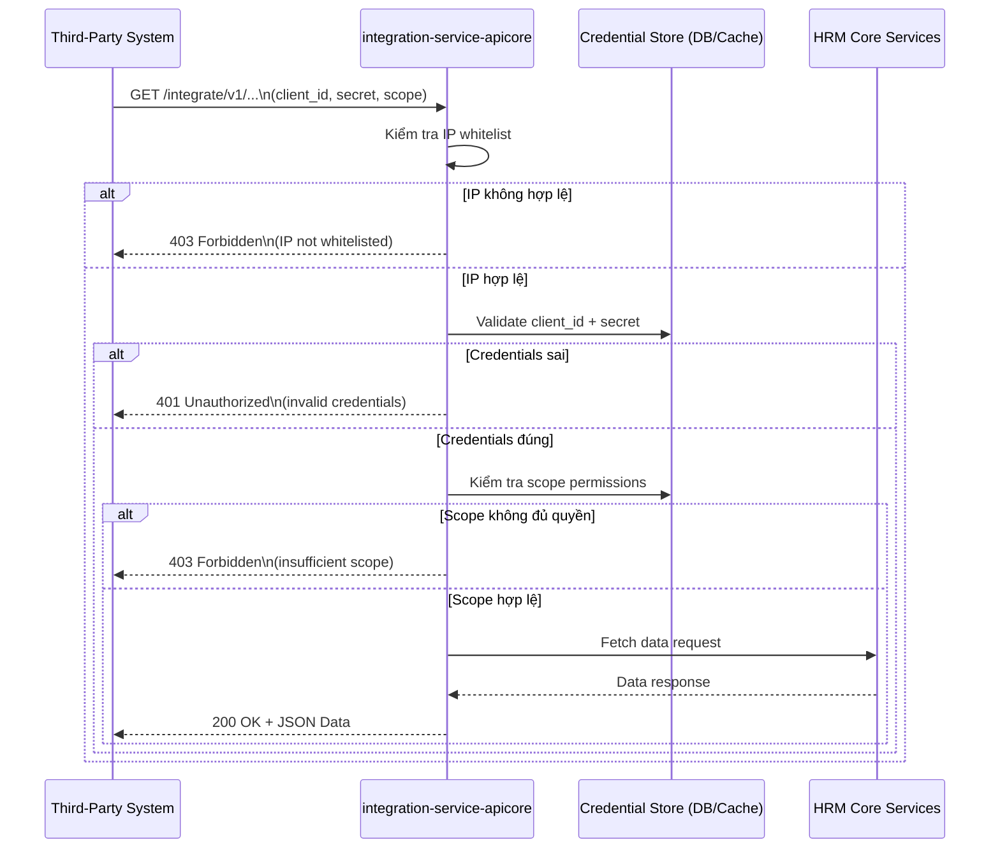

# Flow — Tích hợp Third-Party gọi HRM API

> **Loại**: Integration Flow  
> **Trigger**: Hệ thống bên thứ ba gọi `GET /integrate/v1/...`  
> **Kết quả**: 200 JSON data từ HRM Core, hoặc 401/403 nếu không hợp lệ

---

## Tổng quan

Luồng xử lý khi hệ thống bên thứ ba gọi vào **integration-service-apicore** để lấy dữ liệu từ HRM.  
Có 3 lớp bảo vệ: IP whitelist → Credential validation → Scope check.  
Chỉ request vượt qua cả 3 lớp mới được fetch data.

---

## Sơ đồ



---

## Chi tiết từng bước

### Bước 1 — Third-party gửi request
**Người thực hiện**: Hệ thống bên thứ ba  
- Gọi `GET /integrate/v1/<endpoint>`
- Header: `client_id`, `secret`
- Query params: `scope` (quyền cần truy cập)

### Bước 2 — Kiểm tra IP whitelist
**Người thực hiện**: integration-service-apicore (tự động)  
- So sánh IP nguồn với danh sách whitelist đã cấu hình
- **Nếu không hợp lệ**: trả `403 Forbidden` ngay lập tức

### Bước 3 — Validate credentials
**Người thực hiện**: integration-service-apicore ↔ Credential Store  
- Tra cứu `client_id` trong DB
- Hash-compare `secret`
- **Nếu sai**: trả `401 Unauthorized`

### Bước 4 — Kiểm tra scope
**Người thực hiện**: integration-service-apicore  
- Kiểm tra `client_id` có được phép truy cập endpoint đó không
- **Nếu thiếu quyền**: trả `403 Forbidden`

### Bước 5 — Fetch data từ HRM Core
**Người thực hiện**: integration-service-apicore → HRM Core  
- Gọi sang hr-service / apicore để lấy data
- Format response thành JSON

### Bước 6 — Trả kết quả
**Người thực hiện**: integration-service-apicore  
- `200 OK` + JSON payload

---

## Bảng phản hồi

| Trường hợp | Code | Mô tả |
|-----------|------|-------|
| IP không trong whitelist | **403** | Bên thứ ba không được phép gọi từ IP đó |
| client_id / secret sai | **401** | Sai credentials |
| Đủ creds nhưng thiếu scope | **403** | Có tài khoản nhưng không có quyền endpoint |
| Thành công | **200** | JSON data từ HRM Core |

---

## Cấu hình cần thiết (VNR setup)

```
Per third-party client:
  - client_id: unique string
  - secret: hashed password
  - allowed_ips: ["1.2.3.4", "5.6.7.8"]
  - scopes: ["employee:read", "payroll:read", ...]
```

---

## Điểm rủi ro

| Rủi ro | Tác động | Phòng tránh |
|--------|---------|------------|
| IP whitelist bị bypass (proxy) | Unauthorized access | Log + monitor IP anomaly |
| Secret lộ | Full data access | Rotate secret định kỳ |
| Scope quá rộng | Lộ data nhạy cảm | Phân quyền scope granular |
| Rate limiting thiếu | DoS từ third-party | Add rate limiter per client_id |

---

## Liên kết

- [[wiki/sources/p9k2w-deploy-k8s-hrm-planning]] — Tài liệu kế hoạch
- [[wiki/architecture/p9k2w-k8s-hrm-service-architecture]] — Vị trí integration-service trong kiến trúc
- [[wiki/flows/m3t7x-flow-cicd-deploy-k8s]] — Luồng deploy service này
