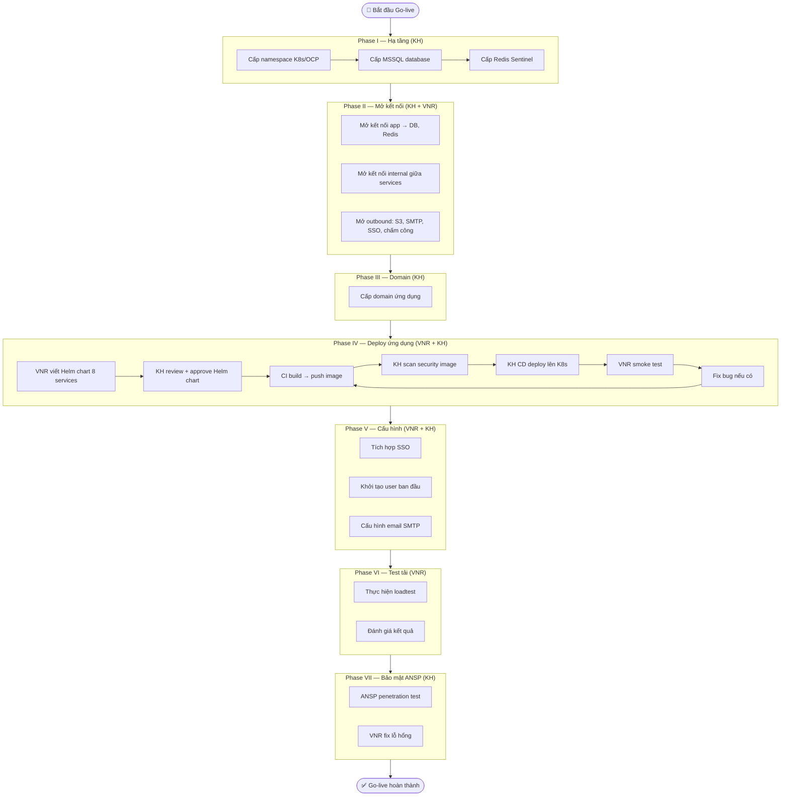
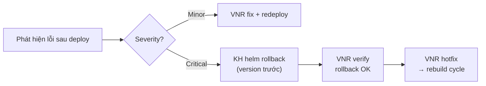

# Flow — Go-live HRM lên K8s PROD

> **Loại**: System Flow  
> **Trigger**: Quyết định go-live sau khi UAT sign-off  
> **Kết quả**: Hệ thống HRM chạy ổn định trên K8s PROD của KH

---

## Tổng quan

Quy trình go-live chia thành **7 phase** từ hạ tầng đến bảo mật, phân công rõ VNR / KH.  
Tổng 21 tasks, phần lớn không có downtime (greenfield deployment lần đầu).

---

## Sơ đồ tổng thể



---

## Chi tiết từng phase

### Phase I — Triển khai hạ tầng
**Owner**: KH  
**Đầu ra cần có:**
- Namespace K8s/OCP đã cấp, VNR biết namespace name
- MSSQL: IP, port 1433, credentials (inject vào Vault/Secret)
- Redis Sentinel: 3 nodes, IP, port 6379/26379, password
- Storage `/data` 200GB và `/backup` 100GB đã mount cho MSSQL

### Phase II — Mở kết nối
**Owner**: KH (network) + VNR (cung cấp danh sách)  
**VNR gửi KH danh sách:**
```
Internal egress:
  - All services → mssql:1433
  - All services → redis:6379, :26379
  - All services → sc-service-identity:8080

Outbound external:
  - All services (trừ identity) → S3:443
  - windows-servicecore → smtp.gmail.com:587
  - integration-service → SSO endpoint:443
  - integration-service → chấm công API:443
```

### Phase III — Domain
**Owner**: KH  
- Cấp domain cho empportal, main, integration endpoint
- Cấu hình SSL certificate

### Phase IV — Deploy ứng dụng
**Helm chart cần cho 8 services** — mỗi chart gồm: Deployment, Service, ServiceMonitor, HPA, ConfigMap ref, Secret ref  
**Loop:** Build → Scan → Deploy → Test → Fix → (lặp lại nếu cần)

### Phase V — Cấu hình
**SSO**: VNR + KH phối hợp cấu hình Identity Server ↔ SSO Provider của KH  
**User**: Import dữ liệu user ban đầu, phân quyền admin  
**Email**: Test gửi email thông báo từ windows-servicecore

### Phase VI — Test tải
**Sizing**: Dùng [[wiki/sources/p9k2w-deploy-k8s-hrm-planning]] → `06-Deploy-Sizing-Loadtest`  
**Chỉ số cần đo**: TPS đỉnh, P95/P99 response time, error rate, CPU/RAM utilization, HPA behavior

### Phase VII — Bảo mật ANSP
**Owner**: KH (ANSP team thực hiện pentest)  
**VNR**: Nhận báo cáo → fix lỗ hổng → confirm với KH

---

## Rollback plan (chỉ PROD)



---

## Điểm rủi ro

| Rủi ro | Tác động | Phòng tránh |
|--------|---------|------------|
| KH chậm cấp hạ tầng | Delay toàn bộ timeline | Theo dõi Phase I sát sao |
| Helm chart thiếu config | Pod crash khi deploy | Test trên UAT trước |
| SSO tích hợp lỗi | User không login được | Test SSO riêng trước go-live |
| Pentest phát hiện critical | Delay go-live | Fix security issue song song với test tải |
| HPA không hoạt động | Overload khi tải cao | Test HPA trên loadtest env |

---

## Liên kết

- [[wiki/sources/p9k2w-deploy-k8s-hrm-planning]] — Chi tiết 21 tasks đầy đủ
- [[wiki/flows/m3t7x-flow-cicd-deploy-k8s]] — Luồng CI/CD chi tiết
- [[wiki/flows/Flow-UAT-Process]] — Quy trình UAT trước go-live
- [[wiki/architecture/p9k2w-k8s-hrm-service-architecture]] — Kiến trúc service
