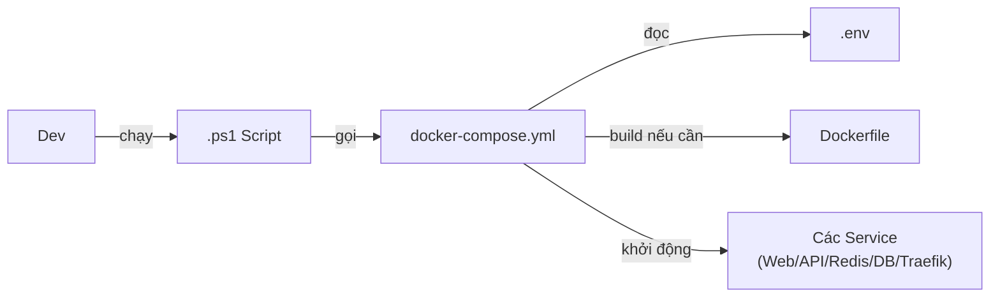

# Architecture — Docker HRM VnPay

> **Loại**: Infrastructure
> **Mô tả**: Docker được dùng trong dự án HRM VnPay để đóng gói và chạy hệ thống đồng bộ trên mọi môi trường (local, UAT, production). Series tài liệu gồm 8 file, tạo 2026-01-18.

---

## Sơ đồ luồng chạy

---

## Thành phần

| Component | Vai trò | Ghi chú |
|-----------|---------|---------|
| `Dockerfile` | Công thức build image | Ít sửa, chỉ xem khi build fail |
| `docker-compose.yml` | Khai báo và ghép nhiều container | Map port, volume, network |
| `.env` | Cấu hình biến môi trường | Port, S3 key, DB connection — **80% lỗi nằm ở đây** |
| `.ps1` scripts | Wrapper chạy Docker chuẩn cho cả team | Dev không cần nhớ lệnh Docker |
| Redis | Cache dùng chung | Chạy qua Docker |
| Traefik | Reverse proxy / load balancer | Chạy qua Docker |

---

## Kết nối / Integration

- Docker đứng **giữa code và hạ tầng** — dev không cần hiểu sâu về server
- Trên K8s (VnPay production): các container được orchestrate qua Kubernetes, namespace `hrm-vnr-pilot`
- HelmChart dùng để deploy microservices lên K8s (xem `wiki/sources/2026-05-07-k8s-plan-vnpay`)

---

## Troubleshooting nhanh

| Hiện tượng | File cần xem |
|------------|-------------|
| Không chạy được | `.ps1` |
| Chạy nhưng lỗi kết nối | `.env` |
| Service không lên | `docker-compose.yml` |
| Build fail | `Dockerfile` |

---

## Raw sources

- `raw/archive/1.Projects/Dự án 2026/VnPay-Project/Documents/Dockers/00-MOC-Docker-HRM.md` (MOC)
- `raw/archive/1.Projects/Dự án 2026/VnPay-Project/Documents/Dockers/01~08-*.md` (series 8 file)

---

## Liên kết

- [[wiki/projects/VnPay-Project]]
- [[wiki/sources/2026-05-07-k8s-plan-vnpay]]
