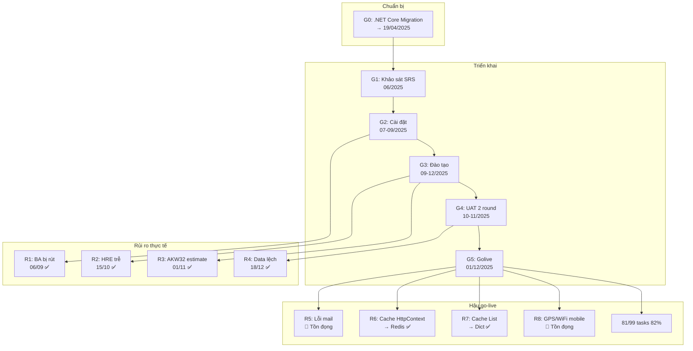

# Tổng hợp Toàn Cảnh Dự Án Bitex-AKW

## Document History

| Ngày | Phiên bản | Mô tả | Người tạo |
|------|-----------|-------|-----------|
| 01/05/2026 | 1.0.0 | Tạo tài liệu tổng hợp toàn cảnh Bitex | Tung.Ly |

---

## Nội dung – Content

- [1. Giới thiệu tài liệu](#1-giới-thiệu-tài-liệu)
  - [1.1 Mục tiêu tài liệu](#11-mục-tiêu-tài-liệu)
  - [1.2 Từ viết tắt](#12-từ-viết-tắt)
- [2. Bức tranh toàn cảnh](#2-bức-tranh-toàn-cảnh)
- [3. Các điểm cốt lõi](#3-các-điểm-cốt-lõi)
- [4. Biểu đồ & Sơ đồ](#4-biểu-đồ--sơ-đồ)
- [5. Quy luật & Mâu thuẫn](#5-quy-luật--mâu-thuẫn)
- [6. Khuyến nghị](#6-khuyến-nghị)

---

# 1. Giới thiệu tài liệu

## 1.1 Mục tiêu tài liệu

Tài liệu này cung cấp bức tranh toàn cảnh về dự án Bitex-AKW — từ khởi động, triển khai 5 giai đoạn, golive đến trạng thái hậu vận hành tính đến 01/05/2026. Dành cho PM, SE, PE cần nắm nhanh toàn bộ thông tin dự án, bài học kinh nghiệm và các rủi ro còn tồn đọng.

## 1.2 Từ viết tắt

| STT | Thuật ngữ | Ý nghĩa |
|-----|-----------|---------|
| 1 | HRM | Human Resource Management — Phần mềm quản lý nhân sự VnResource |
| 2 | SE | Software Engineer — Kỹ sư phát triển phần mềm |
| 3 | PE | Project Engineer — Kỹ sư triển khai dự án |
| 4 | PM | Project Manager — Quản lý dự án |
| 5 | BA | Business Analyst — Phân tích nghiệp vụ |
| 6 | HRE | Phân hệ Hợp đồng lao động |
| 7 | ATT | Phân hệ Chấm công |
| 8 | TRA | Phân hệ Tuyển dụng |
| 9 | UNI | Phân hệ Đồng phục |
| 10 | UAT | User Acceptance Testing — Kiểm thử nghiệm thu |
| 11 | SRS | Software Requirements Specification — Tài liệu yêu cầu phần mềm |
| 12 | AMIS | Hệ thống quản lý nội bộ VnResource |
| 13 | TCDA | Tên gọi của nhóm quản lý thi công nội bộ |
| 14 | AKW | Chuỗi cửa hàng bán lẻ (khách hàng, cùng hợp đồng với Bitex) |
| 15 | OT | Overtime — Làm thêm giờ |
| 16 | RCA | Root Cause Analysis — Phân tích nguyên nhân gốc rễ |

---

# 2. Bức tranh toàn cảnh

Dự án Bitex-AKW (mã **25010206-01**) là một trong những dự án triển khai HRM đáng chú ý nhất năm 2025 với mô hình hợp đồng đặc biệt: **2 khách hàng (Bitex và AKW) ký 2 hợp đồng riêng biệt nhưng dùng chung 1 hệ thống HRM**. Đây là tiền lệ được tổ chức tham chiếu cho các dự án đa hợp đồng sau này ([[wiki/sources/Bitex-Chat-ChiHuyThiCong]]).

Dự án khởi động 02/06/2025, trải qua 5 giai đoạn chính (cộng thêm G0 chuẩn bị kỹ thuật chuyển đổi .NET Core), và golive thành công vào **01/12/2025** đúng kế hoạch. Đến 01/05/2026, dự án đang trong giai đoạn hỗ trợ vận hành dài hạn với **82% task hoàn thành** (81/99), 2 rủi ro kỹ thuật còn tồn đọng (lỗi gửi mail và sự cố GPS/WiFi mobile chấm công) ([[wiki/projects/Bitex-Project]]).

Điểm kỹ thuật nổi bật: chuyển đổi .NET Framework → .NET Core được thực hiện **song song** với dự án, thay vì tuần tự. Dự án cũng triển khai tích hợp API real-time (HRM gọi API KH để lấy dữ liệu thay vì import file tĩnh) — một yêu cầu kỹ thuật phức tạp hiếm gặp ([[wiki/sources/Bitex-Project-Overview]]).

---

# 3. Các điểm cốt lõi

| # | Điểm | Nguồn | Độ tin cậy |
|---|------|-------|------------|
| 1 | 2 HĐ - 1 hệ thống: Bitex + AKW dùng chung branch `BITEX_v8.12.48.01.09`, 1 project AMIS, hạch toán tài chính chia đôi | [[wiki/projects/Bitex-Project]] | Dữ kiện |
| 2 | Timeline thực tế: G0 chuẩn bị .NET Core (→ 19/04/2025), G1 Khảo sát (06/2025), G2 Cài đặt (07–09/2025), G3 Đào tạo (09–12/2025), G4 UAT (10–11/2025), G5 Golive 01/12/2025 | [[wiki/flows/Flow-Bitex-Phases]] | Dữ kiện |
| 3 | 8 rủi ro phát sinh: R1–R4 đã xử lý, R5 (mail) và R8 (GPS/WiFi) còn tồn đọng | [[wiki/projects/Bitex-Project]] | Dữ kiện |
| 4 | Golive đúng hạn 01/12/2025, không trễ ngày mục tiêu chính | [[wiki/sources/Bitex-Project-Overview]] | Dữ kiện |
| 5 | Hậu go-live: 81/99 tasks hoàn thành (82%), bottleneck là 8 báo cáo bảng công (0% done) và 7 mẫu Word | [[wiki/sources/Bitex-TaskList-PostGoLive]] | Dữ kiện |
| 6 | Incident GPS/WiFi mobile từ 18/03/2026 (hơn 1 tháng không ghi nhận được chấm công GPS) — vấn đề phía app trước khi gọi API | [[wiki/sources/2026-04-29-bitex-cham-cong-gps-wifi-loading]] | Dữ kiện |
| 7 | 2 lỗi cache sau golive: HttpContext.Cache → Redis (R6), List lookup O(n) → Dictionary O(1) (R7) | [[wiki/sources/Bitex-Project-Overview]] | Dữ kiện |
| 8 | Nghiệp vụ chấm công AKW phức tạp: tính từ phút 6, chặn 4 lần/tháng, trừ phép năm → phép bù → lương, GPS per cửa hàng | [[wiki/sources/Bitex-TaskList-PostGoLive]] | Dữ kiện |
| 9 | Nguồn lực là điểm yếu cốt lõi: BA bị rút không thông báo (R1), SE deadline trễ cascade (R2) | [[wiki/sources/Bitex-Chat-ChiHuyThiCong]] | Dữ kiện |
| 10 | Nguyên tắc vàng: "SE xong ≠ Dự án đảm bảo" — chuỗi: SE → PE test → KH test → Nghiệm thu | [[wiki/sources/Bitex-Project-Overview]] | Dữ kiện |

---

# 4. Biểu đồ & Sơ đồ

## 4.1 Biểu đồ số liệu (Charts View)

#### 📈 Tiến độ Task Hậu Go-Live theo Hạng mục (04/2026)

> 💡 Raise Task, Test, Issues, Hỗ trợ KH hầu như đã xong. Điểm nghẽn rõ ràng là Cấu hình Báo cáo (0%) và Xuất Word (58%) — cần ưu tiên ngay.

```chartsview
#-----------------#
#- chart type    -#
#-----------------#
type: Column

#-----------------#
#- chart data    -#
#-----------------#
data:
  - label: "Raise Task"
    value: 100
  - label: "Test Task"
    value: 100
  - label: "Import Data"
    value: 91
  - label: "Issues Log"
    value: 95
  - label: "Hỗ trợ KH"
    value: 100
  - label: "Check bảng công"
    value: 75
  - label: "Xuất Word"
    value: 42
  - label: "Báo cáo"
    value: 0

#-----------------#
#- chart options -#
#-----------------#
options:
  xField: "label"
  yField: "value"
  label:
    position: "middle"
  meta:
    value:
      alias: "% Hoàn thành"
```

> 🎯 **Nên làm**: Ưu tiên thu thập spec báo cáo bảng công từ KH để unblock 8 báo cáo đang ở 0%.

---

#### 📈 Phân bổ Rủi ro theo Trạng thái (R1–R8)

> 💡 6/8 rủi ro đã được xử lý thành công, còn 2 rủi ro tồn đọng — đặc biệt GPS/WiFi đã kéo dài hơn 1 tháng mà chưa có fix.

```chartsview
#-----------------#
#- chart type    -#
#-----------------#
type: Pie

#-----------------#
#- chart data    -#
#-----------------#
data:
  - type: "Đã xử lý"
    value: 6
  - type: "Còn tồn đọng"
    value: 2

#-----------------#
#- chart options -#
#-----------------#
options:
  angleField: "value"
  colorField: "type"
  radius: 0.8
  label:
    type: "spider"
    content: "{percentage}\n{name}"
  legend:
    layout: "horizontal"
    position: "bottom"
```

> 🎯 **Nên làm**: Mở RCA chính thức cho R8 (GPS/WiFi) — đã quá 1 tháng, cần escalate Mobile team với deadline rõ ràng.

---

#### 📈 Phân bổ 6 Phân Hệ Triển Khai

> 💡 HRE và ATT là 2 phân hệ phức tạp nhất (hậu go-live vẫn còn task). TRA và UNI ít tài liệu nghiệp vụ nhất trong context Bitex.

```chartsview
#-----------------#
#- chart type    -#
#-----------------#
type: Pie

#-----------------#
#- chart data    -#
#-----------------#
data:
  - type: "HRE (Hợp đồng)"
    value: 30
  - type: "ATT (Chấm công)"
    value: 30
  - type: "Portal"
    value: 15
  - type: "APP (Mobile)"
    value: 15
  - type: "TRA (Tuyển dụng)"
    value: 5
  - type: "UNI (Đồng phục)"
    value: 5

#-----------------#
#- chart options -#
#-----------------#
options:
  angleField: "value"
  colorField: "type"
  radius: 0.8
  label:
    type: "spider"
    content: "{percentage}\n{name}"
  legend:
    layout: "horizontal"
    position: "bottom"
```

> 🎯 **Nên làm**: Bổ sung tài liệu nghiệp vụ TRA và UNI vào wiki để coverage đủ 6 phân hệ.

## 4.2 Sơ đồ quan hệ (Mermaid)



---

# 5. Quy luật & Mâu thuẫn

## Quy luật rút ra

| # | Quy luật | Bằng chứng |
|---|---------|------------|
| 1 | **Nguồn lực là điểm yếu hệ thống** — mọi delay đều bắt đầu từ thiếu/rút nhân sự | R1 (BA), R2 (SE cascade) |
| 2 | **Cache design phải review trước golive** — 2/8 rủi ro sau golive đều là cache | R6 (HttpContext), R7 (List) |
| 3 | **1 nguồn dữ liệu duy nhất tránh lệch** — Google Sheet online loại bỏ xung đột | R4 (file offline vs online) |
| 4 | **Multi-contract = 1 project** — gộp quản lý, tách tài chính là mô hình tối ưu | Quyết định 22/08/2025 |
| 5 | **Buffer SE→UAT là bắt buộc** — không có buffer thì cascade delay | R2 (HRE trễ, không có thời gian PE test) |
| 6 | **Mobile incident khó trace** — lỗi app trước API, cần log từng bước | R8 (GPS/WiFi từ 18/03/2026) |

## Mâu thuẫn phát hiện

| # | Mâu thuẫn | Ghi chú |
|---|----------|--------|
| 1 | Golive đúng hạn 01/12 nhưng Training kéo dài đến 18/12 — 2 mốc thời gian chồng lấn | Giai đoạn 3 và 5 overlap; [inference] Training tiếp tục sau golive là bình thường với retail |
| 2 | WiFi check-in vẫn có case thành công trong khi GPS không ghi nhận từ 18/03 — 2 phương thức cùng app nhưng hành vi khác nhau | Gợi ý lỗi ở GPS module cụ thể, không phải toàn bộ luồng |
| 3 | Synthesis cũ (27/04/2026) chưa có R8 GPS/WiFi — tài liệu cần cập nhật định kỳ sau incident mới | Cần thiết lập quy trình update synthesis khi có incident mới |

---

# 6. Khuyến nghị

| Ưu tiên | Hành động |
|---------|-----------|
| 🔴 Cao | **Escalate R8 GPS/WiFi** — đã >1 tháng không có dữ liệu chấm công GPS. Yêu cầu Mobile team log từng bước: permission → GPS resolve → build payload. Đặt deadline fix trong 2 tuần |
| 🔴 Cao | **Unblock 8 báo cáo bảng công** (0% done) — thu thập spec từ KH Bitex/AKW, assign PE Tuyết Anh + SE support cấu hình |
| 🟡 Trung bình | **RCA chính thức R5 lỗi mail** — giao Trung.Pham + Lý Nhuận Tùng viết fix plan rõ ràng, không để "đang theo dõi" mãi |
| 🟡 Trung bình | **Hoàn thành 7 mẫu Word** — HDLD, Cam kết bảo mật, Thư tuyển dụng. Ưu tiên theo yêu cầu KH |
| 🟡 Trung bình | **Viết playbook "2 HĐ 1 hệ thống"** — tài liệu hóa quyết định AMIS, tài chính, source code, build để áp dụng cho dự án tương lai |
| 🟢 Thấp | **Bổ sung wiki TRA và UNI** — hiện 2 phân hệ này thiếu tài liệu nghiệp vụ trong context Bitex |
| 🟢 Thấp | **Chuẩn hóa checklist thay đổi nhân sự** — bắt buộc thông báo PE/PM trước 3 ngày khi điều chuyển BA/SE |

---

## 💬 3 Câu hỏi suy ngẫm

1. 🧠 **[Giả định]** Nếu dự án Bitex áp dụng buffer SE→UAT ngay từ ngày lập kế hoạch (G1), R2 có xảy ra không — và nếu không có R2, liệu còn rủi ro nào khác sẽ lộ ra mà R2 đã che khuất?

2. 🧪 **[Thí nghiệm]** Mô hình "2 hợp đồng 1 hệ thống" đang hoạt động tốt với Bitex + AKW (cùng ngành retail). Nếu áp dụng cho 2 khách hàng khác ngành (ví dụ: sản xuất + bệnh viện), quy trình nghiệp vụ khác biệt có làm vỡ mô hình gộp này không — hay cần điều kiện gì để mô hình này luôn đúng?

3. 🌐 **[Kết nối]** Lỗi cache HttpContext→Redis (R6) và lỗi cache List→Dictionary (R7) đều là kỹ thuật đã có trong [[wiki/sources/Daily-2024-Cache-Redis]]. Quy trình deploy hiện tại ([[wiki/flows/Flow-Deploy-HRM]]) có bước review cache strategy không — nếu không, đây là gap cần bổ sung vào [[wiki/concepts/HRM-Deploy-Checklist]].
