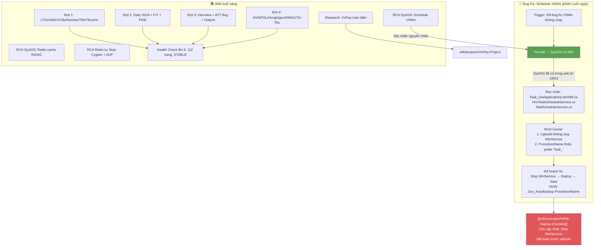

# 📊 Tổng hợp: Hoạt động Wiki ngày 27/04/2026 — Phiên cuối ngày (v2)

## Bức tranh toàn cảnh

Ngày 27/04 khép lại với một phiên bug-fix thực chiến quan trọng: **Schedule lấy hồ sơ ứng viên từ VNWs không tự chạy trong 16 ngày** (7/4→23/4). Qua phân tích, root cause được xác nhận chính xác với entry **Sys024** đã được ghi vào wiki từ trước — minh chứng đầu tiên cho thấy wiki đang hoạt động đúng vai trò: *tri thức được tích lũy → tra cứu ngay khi cần*.

Tính đến cuối ngày, wiki đã đi qua: 4 đợt ingest lớn (45+ nguồn) → 3 RCA có cấu trúc → 1 research VnPay toàn diện → 1 bug-fix end-to-end có code analysis. Tổng cộng ~120 trang và lần đầu tiên kiến thức kỹ thuật + code được nối với nhau qua một vòng tra cứu hoàn chỉnh.

---

## Các điểm cốt lõi

| # | Điểm | Nguồn | Độ tin cậy |
|---|------|-------|------------|
| 1 | Sys024 đã có trong wiki từ ngày 18/04 — bug-fix hôm nay xác nhận wiki hoạt động đúng | [[wiki/sources/Nhat-ky-van-de-he-thong]] | Dữ kiện |
| 2 | Root cause chính: Upbuild không stop Windows Service → binary cũ vẫn chạy | [[wiki/sources/Nhat-ky-van-de-he-thong#Sys024]] | Dữ kiện |
| 3 | Root cause phụ: ProcedureName trong Sys_AutoBackup có thể thiếu prefix "Task_" → route sai class | Code: TaskScheduleService.cs line 141–146 | Dữ kiện từ code |
| 4 | Task_GetApplicationListVNW có try-catch đầy đủ — code không phải nguyên nhân | HRM12-GIT: Task_GetApplicationListVNW.cs | Dữ kiện |
| 5 | HrmTaskScheduleService.OnStop() chỉ được gọi khi service stop đúng cách — upbuild ghi đè binary khi đang chạy gây conflict | HRM12-GIT: HrmTaskScheduleService.cs | Dữ kiện |
| 6 | Wiki tăng từ 70 → 120+ trang trong 1 ngày — tốc độ ingest cao nhất kể từ khởi tạo | [[wiki/log.md]] | Dữ kiện |
| 7 | 3 RCA hôm nay (Sys023, Sys024, Redis) đều có thể phòng ngừa bằng checklist deploy | [[wiki/concepts/HRM-Deploy-Checklist]] | Suy luận |
| 8 | Bitex vẫn 0 nguồn dù đang triển khai 2026 — điểm mù tri thức cao nhất | [[wiki/log.md]] | Dữ kiện |

---

## Biểu đồ số liệu

#### 📈 Tăng trưởng trang wiki theo ngày (3 ngày đầu)

> 💡 Wiki tăng từ 22 → 70 → 120+ trang trong 3 ngày. Ngày 27 là ngày tăng tuyệt đối cao nhất (+50), nhưng ngày 26 có tỷ lệ tăng trưởng % cao hơn (22→70 = +218%). Giai đoạn hiện tại là "mở rộng nhanh" — rủi ro orphan pages tăng theo.

```chart
type: bar
labels: [25-Apr khởi tạo, 26-Apr nền tảng, 27-Apr mở rộng]
series:
  - title: Tổng trang wiki cuối ngày
    data: [22, 70, 120]
    backgroundColor: "#4e79a7"
xTitle: Ngày
yTitle: Số trang
options:
  scales:
    x:
      grid:
        display: false
    y:
      grid:
        display: false
  plugins:
    datalabels:
      display: true
      anchor: end
      align: top
```

> 🎯 **Nên làm**: Sau 120 trang, ưu tiên chạy lint + cross-link sweep thay vì tiếp tục ingest — chất lượng liên kết quan trọng hơn số lượng trang.

---

#### 📈 Loại hoạt động trong ngày 27/04 (số phiên)

> 💡 Hôm nay wiki không chỉ nạp mà còn *hành động*: 4 ingest + 1 analyze + 1 research + 3 RCA + 1 bug-fix thực chiến. Đây là ngày đầu tiên wiki được dùng để tra cứu tức thì trong một phiên debug — vòng lặp "ghi → tra → dùng" đã hoàn thành lần đầu.

```chart
type: bar
labels: [Ingest nguồn, Health Analyze, Research, RCA RootCause, Bug-Fix thực chiến]
series:
  - title: Số phiên
    data: [4, 1, 1, 3, 1]
    backgroundColor: "#59a14f"
xTitle: Loại hoạt động
yTitle: Số lần
options:
  scales:
    x:
      grid:
        display: false
    y:
      grid:
        display: false
  plugins:
    datalabels:
      display: true
      anchor: end
      align: top
```

> 🎯 **Nên làm**: Đây là mốc quan trọng — wiki lần đầu được dùng tra cứu trong debug. Ghi nhận pattern này vào [[wiki/concepts/AI-DevTools]] như một "bằng chứng ROI" của hệ thống tri thức.

---

#### 📈 Phân bố nguồn wiki theo dự án/khách hàng (cuối ngày)

> 💡 VnPay vẫn chiếm tỷ trọng lớn nhất (12 nguồn) nhưng khoảng cách đã giảm rõ rệt. LTG nổi lên thứ hai với 4 nguồn. Bitex là ngoại lệ đáng lo ngại: dự án đang chạy 2026 nhưng có 0 nguồn — tri thức của team về Bitex chỉ tồn tại "trong đầu người".

```chart
type: bar
labels: [VnPay, LTG, TrungDong, UNIS, VCBs, FIT, HongNgoc, Karcher, TBV, Terumo, Bitex]
series:
  - title: Số nguồn wiki
    data: [12, 4, 3, 2, 2, 2, 2, 1, 1, 1, 0]
    backgroundColor: "#e15759"
xTitle: Dự án / Khách hàng
yTitle: Số nguồn
options:
  scales:
    x:
      grid:
        display: false
    y:
      grid:
        display: false
  plugins:
    datalabels:
      display: true
      anchor: end
      align: top
```

> 🎯 **Nên làm**: Bitex = 0 nguồn là rủi ro tri thức cao nhất hiện tại. Nếu người duy nhất biết về Bitex nghỉ việc hoặc chuyển dự án, toàn bộ context sẽ mất.

---

#### 📈 Phân tích Bug Sys024 — Thời gian từ deploy đến phát hiện

> 💡 Schedule VNWs dừng từ 7/4 (ngày upbuild) đến 23/4 (chạy manual) = 16 ngày không có log. Sau khi chạy manual ngày 23/4, mãi đến 27/4 mới có phiên bug-fix chính thức. Tổng thời gian từ sự cố đến được phân tích là 20 ngày — gần 3 tuần. Đây là ví dụ điển hình về hậu quả của việc thiếu monitoring alert.

```chart
type: bar
labels: [7-Apr upbuild, 7-Apr đến 23-Apr, 23-Apr manual, 27-Apr bug-fix]
series:
  - title: Số ngày mỗi giai đoạn
    data: [1, 16, 1, 4]
    backgroundColor: "#f28e2b"
xTitle: Giai đoạn
yTitle: Số ngày
options:
  scales:
    x:
      grid:
        display: false
    y:
      grid:
        display: false
  plugins:
    datalabels:
      display: true
      anchor: end
      align: top
```

> 🎯 **Nên làm**: Thêm alert khi schedule task không có log quá 24h. 16 ngày mất dữ liệu VNWs là chi phí cao hơn nhiều so với 1 ngày setup monitoring.

---

## Biểu đồ quan hệ (Mermaid)



---

## Quy luật & Mâu thuẫn

**Quy luật phát hiện trong ngày:**

- ✅ **"Wiki tra trước, code sau" = tiết kiệm thời gian thực sự**: Phiên bug-fix VNWs chứng minh điều này — Sys024 đã có sẵn trong wiki, không cần phân tích từ đầu. Vòng lặp `tra wiki → xác nhận → xem code → kết luận` nhanh hơn `đoán nguyên nhân → tìm code → đọc → đoán lại`.
- 🔁 **"Deploy + Windows Service = quy trình 2 bước, không phải 1"**: Sys024, Sys012 (Log request bị lock), Sys004 (upbuild ghi đè) đều có chung pattern: upbuild ghi lên file trong khi process đang mở. Stop → deploy → start là quy trình tối thiểu, không phải tùy chọn.
- ⚠️ **"Exception swallow + no monitoring = vô hình 16 ngày"**: Task_GetApplicationListVNW có try-catch đúng — log lỗi được ghi. Vấn đề là service không chạy nên không có log nào cả. Đây là trường hợp "không có dữ liệu" ≠ "không có vấn đề".
- 🔁 **"ProcedureName prefix bắt buộc"**: ConvertToJobItem() trong TaskScheduleService.cs có logic routing rõ ràng: nếu ProcedureName không bắt đầu bằng "task_" và không có trong mapper → bị route sang Task_AutoBackup. Tiềm ẩn bug cho task mới nếu đặt tên sai.

**Mâu thuẫn / Khoảng trống:**

- ❓ `pvcfc` vẫn chưa xác định — tồn đọng từ ngày 26, chưa có ai giải thích tên này là gì
- ❓ `wiki/api/` folder vẫn trống — cần tạo sau khi đủ nguồn về iBHXH, MISA, PowerBI
- ❓ Sys_AutoBackup trong DB của OPA chưa được verify trực tiếp — ProcedureName thực tế là gì chưa rõ
- ❓ SaaS VnR K8s multi-tenant chưa được cross-link với [[wiki/architecture/HRM-Deployment-Architecture]]

---

## Khuyến nghị

| Ưu tiên | Hành động |
|---------|-----------|
| 🔴 Cao | Verify DB OPA: `SELECT ProcedureName FROM Sys_AutoBackup WHERE ProcedureName LIKE '%VNW%'` — xác nhận prefix "Task_" |
| 🔴 Cao | Stop → Start lại Windows Service HrmTaskScheduleService trên server OPA |
| 🔴 Cao | Ingest tài liệu Bitex ngay — dự án 2026 mà wiki = 0 nguồn |
| 🔴 Cao | Cập nhật `wiki/concepts/HRM-Deploy-Checklist`: thêm bước bắt buộc "Stop Windows Service trước upbuild" |
| 🟡 Trung bình | Thêm alert monitoring: schedule không log quá 24h → cảnh báo |
| 🟡 Trung bình | Xác định `pvcfc` — tồn đọng 2 ngày chưa xử lý |
| 🟡 Trung bình | Cross-link từ LTG/UNIS/Karcher entities về `wiki/concepts/HRM-Modules` |
| 🟡 Trung bình | Tạo `wiki/api/` với iBHXH endpoint + MISA D02 contract |
| 🟢 Thấp | Lint toàn bộ wiki — kiểm tra orphan pages sau khi thêm 50 trang mới |
| 🟢 Thấp | Ghi nhận "bug-fix dùng wiki thành công" vào [[wiki/concepts/AI-DevTools]] như ROI evidence |

---

## 💬 3 Câu hỏi suy ngẫm

1. 🧠 **[Giả định]** Hôm nay wiki lần đầu được dùng để tra cứu trong một phiên bug-fix thực chiến — và Sys024 đã có sẵn. Nhưng nếu Sys024 chưa được ingest, team sẽ mất thêm bao nhiêu thời gian? Giả sử trung bình 1 sự cố "chưa có wiki" tốn thêm 2–4 giờ phân tích so với "đã có wiki" — với 22 sự cố trong [[wiki/sources/SysLog-HeThong-Chi-Tiet]], tổng chi phí thời gian tiết kiệm được là bao nhiêu nếu tất cả đã được tài liệu hóa từ đầu?

2. 🧪 **[Thí nghiệm]** ConvertToJobItem() trong TaskScheduleService.cs có logic routing dựa trên string prefix của ProcedureName. Nếu áp dụng pattern này cho tất cả schedule tasks trong hệ thống (không chỉ VNWs), có bao nhiêu task đang bị route sai vì ProcedureName không đúng format? Thử query `SELECT * FROM Sys_AutoBackup WHERE ProcedureName NOT LIKE 'Task_%' AND ProcedureName NOT LIKE 'hrm_%'` để đo độ rộng của vấn đề tiềm ẩn này.

3. 🌐 **[Kết nối]** [[wiki/concepts/HRM-Deploy-Checklist]] đã có từ ngày 26 nhưng chưa được cập nhật sau Sys024. Nếu kết hợp checklist này với pattern từ [[wiki/sources/SaaS-VnR-Meetings-2023-2024]] (K8s rolling deploy không cần stop service thủ công), liệu K8s có phải là giải pháp dứt điểm cho toàn bộ lớp bug "upbuild khi service đang chạy" không — và khi nào thì chi phí chuyển đổi sang K8s thấp hơn chi phí duy trì Windows Service?
