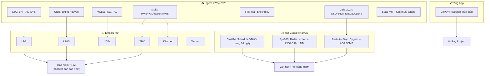

# 📊 Tổng hợp: Hoạt động Wiki ngày 27/04/2026

## Bức tranh toàn cảnh

Nếu ngày 26/04 là ngày wiki **chuyển mình**, thì 27/04 là ngày wiki **bùng nổ**. Chỉ trong một phiên, wiki tăng từ ~70 trang lên ~120+ trang — thêm 50+ trang mới bao gồm 45 nguồn, 6 entities mới, 1 dự án mới (LTG), và 4 tổng hợp/RCA chuyên sâu.

Ba đợt ingest lớn phủ toàn bộ hệ sinh thái dự án 2024–2025 (LTG, UNIS, VCBs, Karcher, TBV, FIT, Terumo, HVN, FGL, AMIS, SaaS VnR). Song song đó, lần đầu tiên wiki có **root cause analysis có cấu trúc** cho 3 sự cố kỹ thuật thực tế, và nghiên cứu chuyên sâu VnPay được hoàn thành toàn diện.

---

## Các điểm cốt lõi

| # | Điểm | Nguồn | Độ tin cậy |
|---|------|-------|------------|
| 1 | Wiki tăng 50+ trang trong 1 ngày — tốc độ cao nhất kể từ khởi tạo | [[wiki/log.md]] | Dữ kiện |
| 2 | Đợt 1 ingest mở ra 13 dự án/khách hàng chưa có wiki (LTG, UNIS, VCBs, Karcher, TBV...) | [[wiki/sources/LTG-INS-Meetings-2024]] | Dữ kiện |
| 3 | Redis tự stop vì Cygwin không supervisor + AOF bloat 56MB — phát hiện qua live RCA | [[wiki/synthesis/rca-redis-stop-restart-20260427]] | Dữ kiện |
| 4 | VnPay là dự án được ghi chép đầy đủ nhất: 13 services K8s + 8 giai đoạn + sự cố nghẽn T11/2025 | [[wiki/synthesis/VnPay-Research-20260427]] | Dữ kiện |
| 5 | 6 entities mới được tạo hôm nay (LTG, UNIS, TBV, Karcher, VCBs, Terumo) | [[wiki/log.md]] | Dữ kiện |
| 6 | BH tự nguyện (UNIS) và BH nâng cao (TBV) là 2 biến thể ít tài liệu hóa nhất trước đây | [[wiki/sources/UNIS-INS-Meetings-2024]], [[wiki/sources/TBV-INS-Meeting-2024]] | Suy luận |
| 7 | Karcher: nghỉ 14 ngày khi không có module Công → giải pháp enum từ chứng từ là pattern mới | [[wiki/sources/Karcher-INS-Meeting-2024]] | Dữ kiện |
| 8 | Health check lần 6: wiki STABLE, tổng ~112 trang, gap tồn đọng: pvcfc entity, iBHXH-Portal, MISA concept | [[wiki/log.md]] | Dữ kiện |

---

## Biểu đồ số liệu

#### 📈 Tăng trưởng trang wiki theo ngày

> 💡 Wiki bắt đầu từ 0 ngày 25/04 và đã tăng 120+ trang sau 3 ngày — ngày 27/04 là ngày tăng mạnh nhất (50+ trang). Tốc độ không đều: ngày 25 khởi động chậm, ngày 26 xây nền tảng, ngày 27 mở rộng toàn diện.

```chart
type: bar
labels: [25-Apr, 26-Apr, 27-Apr]
series:
  - title: Tổng trang wiki cuối ngày
    data: [22, 70, 120]
    backgroundColor: "#4e79a7"
xTitle: Ngày
yTitle: Số trang
options:
  scales:
    x:
      grid:
        display: false
    y:
      grid:
        display: false
  plugins:
    datalabels:
      display: true
      anchor: end
      align: top
```

> 🎯 **Nên làm**: Duy trì nhịp ingest 10–15 trang/ngày thay vì bùng nổ — để có thời gian cross-link và lint sau mỗi đợt.

---

#### 📈 Phân bố nguồn theo loại khách hàng/dự án (sau hôm nay)

> 💡 Từ tình trạng VnPay chiếm 45% hôm qua, hôm nay wiki đã cân bằng hơn đáng kể. LTG vươn lên thành dự án có nhiều tài liệu thứ hai với 4+ nguồn. Tuy nhiên Bitex vẫn là điểm mù tuyệt đối — 0 nguồn dù đang triển khai 2026.

```chart
type: bar
labels: [VnPay, LTG, TrungDong, UNIS, VCBs, FIT, HongNgoc, Karcher, TBV, Bitex]
series:
  - title: Số nguồn wiki
    data: [12, 4, 3, 2, 2, 2, 2, 1, 1, 0]
    backgroundColor: "#59a14f"
xTitle: Dự án / Khách hàng
yTitle: Số nguồn
options:
  scales:
    x:
      grid:
        display: false
    y:
      grid:
        display: false
  plugins:
    datalabels:
      display: true
      anchor: end
      align: top
```

> 🎯 **Nên làm**: Bitex là rủi ro tri thức cao nhất — ưu tiên ingest tài liệu kick-off Bitex trước tuần tới.

---

#### 📈 Loại hoạt động hôm nay (số lần)

> 💡 Hôm nay wiki không chỉ nạp mà còn phân tích: 3 lần RCA thực chiến + 1 research + 1 analyze health check. Tỷ lệ "phân tích/tổng hợp" so với "nạp dữ liệu" là 5:4 — cao hơn hẳn ngày 26 (3:2). Wiki đang chuyển từ kho lưu trữ sang công cụ tư duy.

```chart
type: pie
labels: [Ingest nguồn, Health Analyze, Research, RCA Root Cause, Tổng hợp]
series:
  - title: Số lần
    data: [4, 1, 1, 3, 1]
options:
  plugins:
    datalabels:
      display: true
      formatter: "value"
```

> 🎯 **Nên làm**: Duy trì ít nhất 1 RCA hoặc 1 research mỗi ngày làm việc — đây là loại nội dung tạo ra nhiều giá trị nhất mỗi giờ đầu tư.

---

#### 📈 Entities mới được tạo theo ngày

> 💡 6 entities mới hôm nay (gấp đôi tốc độ 2 ngày trước cộng lại). Điều thú vị: 5/6 entities mới đều là khách hàng BH nâng cao — cho thấy phân hệ Bảo hiểm là điểm nóng tài liệu hóa, không phải ngẫu nhiên mà là có chủ đích.

```chart
type: bar
labels: [25-Apr mới, 26-Apr mới, 27-Apr mới]
series:
  - title: Entities tạo mới
    data: [5, 0, 6]
    backgroundColor: "#e15759"
xTitle: Ngày
yTitle: Số entities
options:
  scales:
    x:
      grid:
        display: false
    y:
      grid:
        display: false
  plugins:
    datalabels:
      display: true
      anchor: end
      align: top
```

> 🎯 **Nên làm**: Cập nhật cross-links ngược lại từ mỗi entity mới về trang `wiki/concepts/HRM-Modules` — hiện chưa có link nào từ LTG, UNIS, Karcher vào concepts.

---

## Biểu đồ quan hệ (Mermaid)



---

## Quy luật & Mâu thuẫn

**Quy luật phát hiện hôm nay:**

- 🔁 **"Phân hệ BH = 1 khách hàng = 1 biến thể"**: Mỗi khách hàng (LTG, UNIS, TBV, Karcher, VnPay) đều có ít nhất 1 yêu cầu BH hoàn toàn độc lập. Không có "BH mặc định" — đây là phân hệ có mức tùy chỉnh cao nhất HRM.
- 🔁 **"Redis chạy không supervisor = time bomb"**: Sys023 và RCA hôm nay đều có cùng root cause: Redis trên Cygwin không có supervisor, AOF bloat → crash định kỳ. Pattern này có thể lặp ở khách hàng dùng môi trường hybrid IIS + Redis tương tự.
- ⚡ **"Windows Service phải stop trước upbuild"**: Sys024 (Schedule VNWs dừng 16 ngày) và Sys023 đều có thể phòng ngừa nếu checklist deploy có bước stop service bắt buộc — đã có trong [[wiki/concepts/HRM-Deploy-Checklist]] nhưng chưa được enforce.

**Mâu thuẫn / Khoảng trống:**

- ❓ Health check lần 6 báo ~112 trang nhưng index.md hiện tại chỉ liệt kê ~108 dòng — có thể do một số trang không được thêm vào index đúng lúc
- ❓ `pvcfc` vẫn chưa được xác định (gap từ ngày 26 chưa giải quyết)
- ❓ `wiki/api/` folder vẫn trống — PowerBI, iBHXH, MISA đều đã có tài liệu nhưng chưa được format API
- ❓ SaaS VnR (K8s multi-tenant, MinIO) có thể liên quan đến kiến trúc VnPay nhưng chưa có cross-link

---

## Khuyến nghị

| Ưu tiên | Hành động |
|---------|-----------|
| 🔴 Cao | Ingest tài liệu Bitex ngay — dự án đang chạy 2026 mà wiki = 0 nguồn |
| 🔴 Cao | Cập nhật `wiki/concepts/HRM-Deploy-Checklist` với bước bắt buộc stop Windows Service trước upbuild |
| 🔴 Cao | Xác định `pvcfc` — tồn đọng 2 ngày chưa xử lý |
| 🟡 Trung bình | Tạo `wiki/api/` — iBHXH endpoint, Power BI Bearer pattern, MISA D02 contract |
| 🟡 Trung bình | Cross-link từ LTG/UNIS/Karcher entities về `wiki/concepts/HRM-Modules` |
| 🟡 Trung bình | Cập nhật `wiki/architecture/HRM-System-Architecture` với SaaS VnR K8s multi-tenant pattern |
| 🟢 Thấp | Lint toàn bộ wiki — kiểm tra orphan pages sau khi thêm 50 trang mới |

---

## 💬 3 Câu hỏi suy ngẫm

1. 🧠 **[Giả định]** Hôm nay wiki thêm 6 entities và 45 nguồn trong 1 ngày — nhưng tốc độ ingest nhanh có nghĩa là cross-links và lint chưa kịp theo. Giả sử 30% trong số các trang mới là "orphan" (không có inbound link từ trang nào khác), liệu chất lượng khả năng tra cứu của wiki có thực sự tốt hơn, hay chỉ là số lượng trang tăng mà tri thức vẫn bị phân mảnh?

2. 🧪 **[Thí nghiệm]** 3 RCA hôm nay (Sys023, Sys024, Redis) đều có thể phòng ngừa bằng checklist deploy hiện có trong [[wiki/concepts/HRM-Deploy-Checklist]]. Nếu thử áp dụng checklist đó cho 22 vấn đề hệ thống trong [[wiki/sources/SysLog-HeThong-Chi-Tiet]] — bao nhiêu % sự cố có thể "ngăn chặn bằng quy trình" vs "chỉ phát hiện sau sự kiện"? Tỷ lệ đó đo được hiệu quả thực tế của tài liệu hóa.

3. 🌐 **[Kết nối]** Wiki đã có [[wiki/sources/SaaS-VnR-Meetings-2023-2024]] mô tả K8s multi-tenant và [[wiki/architecture/HRM-Deployment-Architecture]] mô tả K8s VnPay — nhưng hai trang này chưa được cross-link. Nếu tổng hợp cả hai thành một trang `wiki/architecture/SaaS-K8s-MultiTenant.md`, liệu pattern đó có áp dụng được cho Bitex ngay từ đầu, thay vì phải "phát hiện lại" trong quá trình triển khai?
