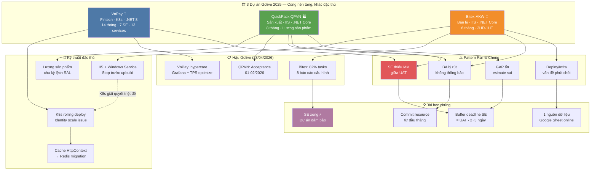

# 📊 Tổng hợp: Toàn cảnh Wiki — Kết thúc ngày 28/04/2026

## Bức tranh toàn cảnh

Ngày 28/04/2026 — wiki đã tích lũy đủ dữ liệu để so sánh **3 dự án triển khai HRM lớn nhất** của VnResource trong 2024–2025: **VnPay** (fintech, K8s, .NET 8), **Bitex-AKW** (bán lẻ, .NET Core, 2 HĐ), và **QuickPack QPVN** (sản xuất, .NET Core, lương sản phẩm). Ba dự án này có cùng nhà cung cấp, cùng nền tảng HRM, cùng golive mốc T12/2025 — nhưng đặc điểm kỹ thuật, rủi ro thực tế, và bài học rút ra hoàn toàn khác nhau.

Sau đợt ingest lớn ngày 27/04 (50+ trang mới, Bitex + QuickPack research được tạo), wiki hiện đang ở trạng thái **"sẵn sàng khai thác"** — đủ nguồn để so sánh đa chiều, phát hiện pattern PM lặp lại, và xác định các gap tri thức còn tồn đọng trước khi bước vào tuần làm việc mới.

---

## Các điểm cốt lõi

| # | Điểm | Nguồn | Độ tin cậy |
|---|------|-------|------------|
| 1 | Cả 3 dự án đều gặp khủng hoảng nguồn lực SE giữa chừng — pattern lặp lại 100% | [[wiki/projects/QuickPack-Project]], [[wiki/projects/Bitex-Project]], [[wiki/sources/VnPay-Goals-Scope-Resources]] | Dữ kiện |
| 2 | VnPay: Identity service không scale → nghẽn 200 users (sự cố lớn nhất) | [[wiki/sources/VnPay-Performance-Incident]] | Dữ kiện |
| 3 | QuickPack: 3 GAP rất phức tạp (REC/UNI/SAL) — estimate sai dẫn đến thiếu MM | [[wiki/sources/QuickPack-Project-Overview]] | Dữ kiện |
| 4 | Bitex: 2 HĐ 1 hệ thống — mô hình đặc biệt, hậu go-live 82% tasks (Tuyết Anh) | [[wiki/projects/Bitex-Project]] | Dữ kiện |
| 5 | Pattern rủi ro chung: BA bị rút → SE gánh thêm → deadline trễ → escalate lên EM | [[wiki/projects/Bitex-Project]], [[wiki/projects/QuickPack-Project]] | Suy luận |
| 6 | VnPay là dự án duy nhất dùng Kubernetes — 13 services, Traefik, Grafana | [[wiki/architecture/HRM-System-Architecture]] | Dữ kiện |
| 7 | Wiki hiện có ~125+ trang, Synthesis/Sources ratio ≈ 11/75 = 14.7% (tăng từ 8%) | [[wiki/index.md]] | Suy luận |
| 8 | Bitex-Research và QuickPack-Research vừa được tạo 27/04 — chưa cross-link với nhau | [[wiki/synthesis/Bitex-Research-20260427]], [[wiki/synthesis/QuickPack-Research-20260427]] | Dữ kiện |
| 9 | TrungDong Phase II đang UAT2 (32 modify) — chưa có synthesis riêng cho Phase II | [[wiki/sources/TrungDong-Eva-Meetings-2025-Supplement]] | Dữ kiện |
| 10 | HongNgoc vừa ingest SSO auto-login (2025) nhưng chưa có synthesis tổng dự án | [[wiki/sources/HongNgoc-AutoLogin-JWT-2025]] | Dữ kiện |

---

## Biểu đồ số liệu

#### 📈 So sánh 3 dự án Golive 2025 — Quy mô & Phức tạp

> 💡 VnPay dẫn đầu về số phân hệ và số nguồn wiki (12). QuickPack nổi bật về số GAP phức tạp (3/8 phân hệ có GAP rất phức tạp). Bitex nhỏ nhất về phân hệ (6) nhưng đặc biệt về mô hình 2HĐ-1HT.

```chart
type: bar
labels: [VnPay, QuickPack, Bitex-AKW]
series:
  - title: Số phân hệ
    data: [10, 8, 6]
    backgroundColor: "#4e79a7"
  - title: Số nguồn wiki
    data: [12, 4, 3]
    backgroundColor: "#f28e2b"
  - title: Số GAP phức tạp
    data: [2, 3, 1]
    backgroundColor: "#e15759"
xTitle: Dự án
yTitle: Số lượng
options:
  scales:
    x:
      grid:
        display: false
    y:
      grid:
        display: false
  plugins:
    datalabels:
      display: true
      anchor: end
      align: top
```

> 🎯 **Nên làm**: QuickPack có tỷ lệ GAP phức tạp/tổng phân hệ cao nhất (3/8 = 37.5%) nhưng số nguồn wiki ít nhất (4). Cần ingest thêm DailyNotes QuickPack tháng 01–04/2026 để cập nhật trạng thái acceptance.

---

#### 📈 Timeline so sánh — Từ Khởi động đến Golive (tháng)

> 💡 Cả 3 dự án đều đạt golive đúng mốc T12/2025, nhưng VnPay có timeline dài nhất (14 tháng). Bitex và QuickPack cùng mốc 01/12/2025 nhưng Bitex chỉ 6 tháng — áp lực thời gian lớn hơn.

```chart
type: bar
labels: [VnPay, QuickPack, Bitex-AKW]
series:
  - title: Thời gian từ Kickoff đến Golive (tháng)
    data: [14, 8, 6]
    backgroundColor: "#59a14f"
xTitle: Dự án
yTitle: Số tháng
options:
  scales:
    x:
      grid:
        display: false
    y:
      grid:
        display: false
  plugins:
    datalabels:
      display: true
      anchor: end
      align: top
```

> 🎯 **Nên làm**: Bitex = 6 tháng cho 6 phân hệ → tốc độ 1 phân hệ/tháng. Đây là benchmark tốt để ước tính khi PM dự án tương tự trong tương lai.

---

#### 📈 Phân bố rủi ro thực tế — 3 dự án Golive 2025

> 💡 Rủi ro nguồn lực (SE bị rút / thiếu MM) là loại phổ biến nhất — xuất hiện trong cả 3 dự án. Rủi ro kỹ thuật phân tán hơn (K8s scale, GAP phức tạp, tích hợp). Không có dự án nào gặp rủi ro về ngân sách.

```chart
type: pie
labels: [Nguồn lực SE bị rút/thiếu, Kỹ thuật GAP phức tạp, Hạ tầng/Performance, Tích hợp đối tác, Dữ liệu offline/online lệch, Hợp đồng đặc thù]
series:
  - title: Phân bố rủi ro
    data: [4, 3, 2, 2, 1, 1]
options:
  plugins:
    datalabels:
      display: true
      formatter: "value"
```

> 🎯 **Nên làm**: Tạo "Risk Register Template" cho PM dự án mới dựa trên 13 rủi ro đã xảy ra từ 3 dự án này — đặc biệt checklist cho rủi ro nguồn lực (xảy ra 4/13 lần).

---

#### 📈 Tăng trưởng Synthesis theo ngày — Tuần đầu wiki

> 💡 Synthesis tăng từ 1 → 11 trang chỉ trong 3 ngày (26–28/04). Tốc độ synthesis ngày 27 là đột phá nhất (+4 trang/ngày). Hôm nay (+1) duy trì momentum. Mục tiêu tuần tới: đạt 15+ synthesis trang.

```chart
type: bar
labels: [25-Apr, 26-Apr, 27-Apr, 28-Apr]
series:
  - title: Tổng số trang Synthesis
    data: [1, 4, 10, 11]
    backgroundColor: "#b07aa1"
xTitle: Ngày
yTitle: Số trang Synthesis
options:
  scales:
    x:
      grid:
        display: false
    y:
      grid:
        display: false
  plugins:
    datalabels:
      display: true
      anchor: end
      align: top
```

> 🎯 **Nên làm**: Mỗi ngày tạo ít nhất 1 synthesis mới — đây là thước đo "wiki đang được tiêu hóa" chứ không chỉ lưu trữ. Target cuối tuần (03/05): 15 trang synthesis.

---

## Biểu đồ quan hệ (Mermaid)



---

## Quy luật & Mâu thuẫn

**Quy luật phát hiện:**

- 🔁 **"Khủng hoảng SE = quy luật, không phải ngoại lệ"**: Cả 3 dự án đều thiếu SE vào thời điểm UAT — đây là điểm đau có hệ thống của VnResource, không phải lỗi PM cá nhân. Giải pháp: pool SE dự phòng + cam kết bằng văn bản từ T-2 tháng trước UAT.
- 📐 **"Dự án ngắn nhất = rủi ro cao nhất"**: Bitex 6 tháng / 6 phân hệ = tốc độ tối đa, không có buffer. Ngược lại VnPay 14 tháng có đủ thời gian R&D K8s, xử lý sự cố performance sau golive. Timeline ngắn buộc phải chấp nhận technical debt.
- 🏗️ **"GAP phức tạp không được estimate đúng từ đầu"**: QuickPack có 3/8 phân hệ GAP rất phức tạp — SAL lương sản phẩm, REC 8 cấp, UNI cảnh báo tồn kho. Những GAP này cần workshop riêng trước SRS, không thể estimate trong họp chung.
- ⚡ **"K8s = giải pháp cho bài toán scale nhưng tạo complexity mới"**: VnPay K8s giải quyết rolling deploy nhưng Identity service vẫn là điểm yếu. IIS đơn giản hơn nhưng Windows Service phải Stop thủ công — đây là trade-off rõ ràng.

**Mâu thuẫn / Khoảng trống:**

- ❓ QuickPack mã dự án `25010206-01` trùng với Bitex `25010206-01` trong wiki — cần kiểm tra lại mã thực tế
- ❓ TrungDong Phase II UAT2 (32 modify) chưa có synthesis — Phase I là Đánh giá, Phase II bổ sung KPI 4 quý; không rõ đã golive chưa
- ❓ LTG Phase 3 status "Archived" nhưng tài liệu vẫn có giá trị — kiêm nhiệm đa pháp nhân, ca 24h là pattern unique chưa được cross-link với QuickPack (cũng có ca đặc thù)
- ❓ HongNgoc chỉ có 2 nguồn (DanhGia-SSO + AutoLogin-JWT-2025) — dự án "Nâng cấp Đánh giá + SSO JWT" chưa rõ trạng thái hiện tại

---

## Khuyến nghị

| Ưu tiên | Hành động |
|---------|-----------|
| 🔴 Cao | Tạo "Risk Register Template" PM dựa trên 13 rủi ro từ 3 dự án 2025 — lưu tại `wiki/concepts/PM-Risk-Register.md` |
| 🔴 Cao | Cross-link [[wiki/synthesis/Bitex-Research-20260427]] ↔ [[wiki/synthesis/QuickPack-Research-20260427]] — 2 dự án cùng golive chưa được so sánh chính thức |
| 🔴 Cao | Verify mã dự án Bitex vs QuickPack trùng `25010206-01` — có thể gây nhầm lẫn trong AMIS |
| 🟡 Trung bình | Tạo synthesis TrungDong Phase II — Phase II UAT2 đang diễn ra, 32 modify KPI 4 quý cần được tài liệu hóa |
| 🟡 Trung bình | Ingest DailyNotes QuickPack T1–T4/2026 để cập nhật acceptance phase (trạng thái 82 ngày sau golive) |
| 🟡 Trung bình | Tạo trang `wiki/concepts/PM-Risk-Register.md` — pattern 3 dự án đã đủ để viết template |
| 🟡 Trung bình | Kiểm tra trạng thái 8 báo cáo cấu hình Bitex còn pending (Tuyết Anh) — có thể escalate |
| 🟢 Thấp | Tạo synthesis tổng quan HongNgoc — dự án nhỏ nhưng có 2 pattern thú vị: SSO JWT + Auto-login đánh giá cũ→mới |
| 🟢 Thấp | Chạy lint wiki sau khi tổng số trang vượt 125 — kiểm tra orphan pages, ghost references |
| 🟢 Thấp | Cross-link LTG (ca 24h, đa pháp nhân) với INS architecture — pattern đặc thù chưa được liên kết |

---

## 💬 3 Câu hỏi suy ngẫm

1. 🧠 **[Giả định]** Cả 3 dự án đều thiếu SE vào đúng thời điểm UAT — và đây được coi là "rủi ro" trong từng dự án. Nhưng nếu nó xảy ra 100% thì đây không phải rủi ro, mà là **đặc tính hệ thống**. Câu hỏi: Tại sao VnResource không duy trì pool SE dự phòng? Liệu [[wiki/concepts/Nguon-Luc]] có phản ánh đúng mô hình quản lý nguồn lực thực tế, hay chỉ là mô hình lý tưởng chưa bao giờ được thực thi?

2. 🧪 **[Thí nghiệm]** Bitex 6 tháng / 6 phân hệ golive thành công — trong khi QuickPack 8 tháng / 8 phân hệ gặp khủng hoảng nguồn lực. Yếu tố nào quyết định: phạm vi phân hệ, độ phức tạp GAP, hay năng lực đội ngũ? Áp dụng [[wiki/concepts/Project-Phases]]: nếu lấy "số GAP phức tạp × 2 tháng" làm đơn vị, Bitex (1 GAP × 2 = +2 tháng buffer) vs QuickPack (3 GAP × 2 = +6 tháng thiếu) — công thức này có giải thích được chênh lệch rủi ro không?

3. 🌐 **[Kết nối]** VnPay dùng K8s rolling deploy và giải quyết được "Stop Windows Service trước upbuild" (Sys024). Nhưng [[wiki/sources/SaaS-VnR-Meetings-Detail-2023]] ghi lại quá trình chuyển đổi SaaS K8s năm 2023 — nếu Bitex và QuickPack đã dùng K8s thay IIS, bao nhiêu trong số 7 rủi ro của họ sẽ không xảy ra? Đây có phải là luận điểm để thuyết phục EM đẩy nhanh lộ trình K8s cho dự án triển khai tiếp theo không?
