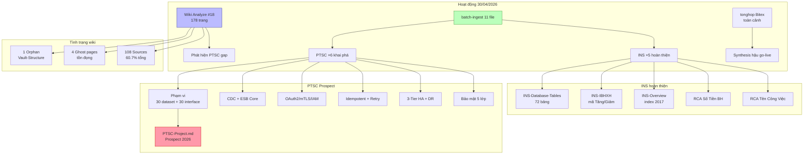

## 📊 Tổng hợp: Tổng kết ngày 30-04-2026

### Bức tranh toàn cảnh

Ngày 30/04/2026 là ngày **nghỉ lễ** nhưng wiki vẫn hoạt động với 2 đợt làm việc chính: **Wiki Analyze lần 18** đánh dấu cột mốc 178 trang tổng, và **batch-ingest 11 file** mở rộng phủ phủ sang 2 miền mới — hoàn thiện phân hệ INS (5 file còn sót) và khai phá prospect **PTSC** (6 file tài liệu giải pháp đấu  quy mô lớn nhất từ trước đến nay). Đây cũng là ngày tổng hợp toàn cảnh Bitex từ góc nhìn vận hành hậu go-live.

Wiki hiện ở trạng thái **ổn định cao**: index-disk khớp tốt, chỉ còn 1 orphan (Vault-Structure tồn đọng từ đầu) và 4 ghost pages. Prospect PTSC mở ra một chiều hướng hoàn toàn mới — tích hợp enterprise ESB/Data Platform — vượt xa scope triển khai thông thường của HRM.

---

### Các điểm cốt lõi

| # | Điểm                                                                                       | Nguồn | Độ tin cậy |
|---|------|-------|------------|
| 1 | Wiki đạt **178 trang** sau analyze lần 18 — tăng ~13 trang so với 29/04                    | [[wiki/log.md]] | Dữ kiện |
| 2 | **11 file ingest** trong ngày: 5 INS + 6 PTSC                                              | [[wiki/log.md]] | Dữ kiện |
| 3 | PTSC là **prospect đấu ** — 30 dataset + 30 interface ESB, hạ tầng HA 5 servers            | [[wiki/projects/PTSC-Project]] | Dữ kiện |
| 4 | INS coverage đạt ~**95%** sau hôm nay — hầu hết source về nghiệp vụ/schema/RCA đã vào wiki | [[wiki/sources/INS-Overview]] | Suy luận |
| 5 | Tổng hợp Bitex toàn cảnh (tonghop) cũng chạy trong ngày — focus hậu go-live 99 tasks       | [[wiki/log.md]] | Dữ kiện |
| 6 | Ghost pages 4 trang (3 RCA + 2 GiaoBan synthesis) vẫn tồn đọng                             | [[wiki/log.md]] | Dữ kiện |

---

### Biểu đồ số liệu (Charts View)

#### 📈 Tăng trưởng wiki theo ngày — từ khởi đầu đến hôm nay

> 💡 Tốc độ tăng trưởng ban đầu rất nhanh (bootstrapping giai đoạn đầu), sau đó ổn định ở mức 13–25 trang/ngày. Hôm nay +13 trang phản ánh giai đoạn "hoàn thiện" thay vì "mở rộng đại trà".

```chartsview
#-----------------#
#- chart type    -#
#-----------------#
type: Column

#-----------------#
#- chart data    -#
#-----------------#
data:
  - label: "25/04"
    value: 14
  - label: "26/04"
    value: 36
  - label: "27/04"
    value: 66
  - label: "28/04"
    value: 8
  - label: "29/04"
    value: 44
  - label: "30/04"
    value: 13

#-----------------#
#- chart options -#
#-----------------#
options:
  xField: "label"
  yField: "value"
  label:
    position: "middle"
  meta:
    value:
      alias: "Số trang tạo mới"
```

> 🎯 **Nên làm**: Tiếp tục nhịp 10–15 trang/ngày để duy trì chất lượng, tránh ingest bulk dẫn đến thiếu cross-link.

---

#### 📊 Phân bố 178 trang wiki theo loại (30/04/2026)

> 💡 Sources chiếm gần 2/3 tổng wiki — phản ánh chiến lược "raw-first": ingest nguồn trước, tổng hợp sau. Synthesis còn thấp (14 trang) cho thấy tiềm năng synthesis chưa khai thác hết.

```chartsview
#-----------------#
#- chart type    -#
#-----------------#
type: Pie

#-----------------#
#- chart data    -#
#-----------------#
data:
  - type: "Sources (108)"
    value: 108
  - type: "Architecture (7)"
    value: 7
  - type: "Flows (11)"
    value: 11
  - type: "Projects (8)"
    value: 8
  - type: "Synthesis (14)"
    value: 14
  - type: "Concepts (15)"
    value: 15
  - type: "Entities (13)"
    value: 13
  - type: "Khác (2)"
    value: 2

#-----------------#
#- chart options -#
#-----------------#
options:
  angleField: "value"
  colorField: "type"
  radius: 0.8
  label:
    type: "spider"
    content: "{percentage}\n{name}"
  legend:
    layout: "horizontal"
    position: "bottom"
```

> 🎯 **Nên làm**: Tạo thêm synthesis tổng hợp từ PTSC (prospect mới) + INS hoàn thiện — 14/178 = 7.9% synthesis là quá thấp so với mục tiêu 15%.

---

#### 📈 Phân bố INS sources theo nhóm chủ đề

> 💡 INS là phân hệ có độ phủ cao nhất trong wiki. Sau đợt ingest hôm nay, nhóm Schema/Database và RCA/Troubleshooting đã hoàn chỉnh.

```chartsview
#-----------------#
#- chart type    -#
#-----------------#
type: Column

#-----------------#
#- chart data    -#
#-----------------#
data:
  - label: "RCA/Bug"
    value: 12
  - label: "Nghiệp vụ"
    value: 8
  - label: "Schema/DB"
    value: 4
  - label: "Biểu mẫu"
    value: 5
  - label: "Tích hợp"
    value: 4
  - label: "Kaizen"
    value: 3

#-----------------#
#- chart options -#
#-----------------#
options:
  xField: "label"
  yField: "value"
  label:
    position: "middle"
  meta:
    value:
      alias: "Số trang sources"
```

> 🎯 **Nên làm**: INS RCA/Bug đã dày đặc — nên tổng hợp 1 synthesis "INS Pattern Analysis" thay vì ingest thêm nguồn rời.

---

### Biểu đồ quan hệ (Mermaid)



---

### Quy luật & Mâu thuẫn

**Quy luật mới quan sát:**
1. **PTSC = level mới**: Đây là prospect đầu tiên yêu cầu ESB + Data Platform — vượt khỏi scope "HRM triển khai" thông thường. Wiki cần thêm concept về `ESB-Pattern`, `CDC-Architecture`, `Data-Platform`.
2. **INS hoàn thiện theo pattern bottom-up**: Bắt đầu từ Kaizen 2017 → RCA → Schema → Nghiệp vụ → Biểu mẫu. Hôm nay là ngày cuối của chuỗi này.
3. **Synthesis lag**: Cứ ~10-15 source mới thêm, chỉ có ~1-2 synthesis được tạo. Tỉ lệ cần cải thiện.

**Mâu thuẫn tồn đọng:**
- Ghost pages `rca-schedule-vnws`, `rca-inoac-redis`, `rca-redis-stop` có trong log nhưng không có file → cần xác nhận thực tế đã lưu chưa
- Bitex tonghop log có entry nhưng file synthesis không tìm thấy trên disk → kiểm tra lại

---

### Khuyến nghị

| Ưu tiên | Hành động |
|---------|-----------|
| 🔴 Cao | Tạo **synthesis PTSC** — prospect lớn nhất, cần 1 báo cáo tổng hợp kỹ thuật đề xuất |
| 🔴 Cao | Kiểm tra và fix **ghost pages** (4 trang) — nếu nội dung thực sự mất, cần ingest lại |
| 🟡 Trung bình | Tạo **INS-Pattern-Analysis synthesis** — tổng hợp toàn bộ 36+ INS sources thành insights |
| 🟡 Trung bình | Tạo **concepts mới**: `ESB-Pattern`, `CDC-Architecture` cho domain tích hợp PTSC |
| 🟡 Trung bình | Cập nhật **wiki/index.md** — thêm 3 synthesis còn thiếu (hoat-dong-28, ket-thuc-final, monthly-rca) |
| 🟢 Thấp | Retire orphan **Vault-Structure** hoặc link vào index.md |

---

## 💬 3 Câu hỏi suy ngẫm

1. 🧠 **[Giả định]** PTSC yêu cầu idempotent API + CorrelationId end-to-end — giả sử HRM hiện tại **chưa có** thiết kế này ở tầng API, thì cần thêm bao nhiêu effort để retrofit, và có nên tách thành một microservice gateway riêng không?

2. 🧪 **[Thí nghiệm]** Nếu áp dụng pattern **CDC Watermark/Version** của PTSC vào bài toán đồng bộ D02-TS từ HRM → iBHXH (đang dùng file export thủ công), liệu latency và tỉ lệ lỗi có giảm như kỳ vọng — hay CDC sẽ tạo thêm phức tạp ở tầng DB do SQL Server HRM không phải thiết kế sẵn cho CDC?

3. 🌐 **[Kết nối]** Tài liệu PTSC §3 IAM đề cập **Keycloak/Entra/ADFS** là IAM options — trong khi wiki đã có [[wiki/sources/Daily-2024-SSO-Auth]] (Okta, Azure AD, ADFS 2024) và [[wiki/flows/Flow-LDAP-Login]] — liệu có thể tái sử dụng pattern SSO hiện có cho PTSC, hay PTSC cần thiết kế IAM riêng vì scope enterprise ESB?
